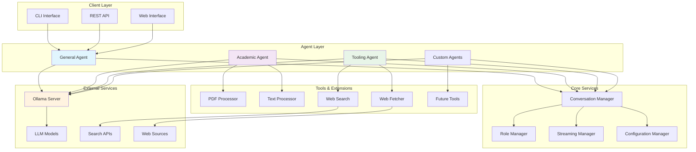

# Kowalski

> "AI agents are like pets – they're cute, but they make a mess."  
> "The future is modular, and so is Kowalski. Want a feature? Open an issue or submit a PR!"


A sophisticated Rust-based multi-agent framework for interacting with various LLM providers, with built-in support for federation, secure multi-party computation, and extensible tooling architecture.

---


## 🌟 Vision & Architecture
Kowalski is designed as a foundational framework for building intelligent, distributed agent systems that can collaborate securely and efficiently. The architecture supports both standalone operation and federated deployments with advanced privacy-preserving capabilities.




```
kowalski/
├── kowalski-core/           # Core agent abstractions, conversation, roles, config, toolchain
├── kowalski-tools/          # Pluggable tools (code, data, web, document, etc.)
├── kowalski-agent-template/ # Agent builder, base agent, and templates
├── kowalski-federation/     # Multi-agent orchestration (WIP)
├── kowalski-academic-agent/ # Academic research agent
├── kowalski-code-agent/     # Code analysis agent
├── kowalski-data-agent/     # Data analysis agent
├── kowalski-web-agent/      # Web research agent
├── kowalski-cli/            # Command-line interface
├── resources/               # Configs, tokenizer, etc.
└── ...                      # Examples, docs, etc.
```

---

## 📦 Module Overview

### **kowalski-core**
- Foundational types, agent abstractions, conversation, roles, configuration, error handling, toolchain logic.
- Designed for extensibility and async-first operation.
- [See details](./kowalski-core/README.md)

### **kowalski-tools**
- Pluggable tools for code, data, web, and document analysis.
- Includes CSV, code (Java/Python/Rust), web search, web scraping, PDF tools, and more.
- **Upcoming:** Will be refactored into even more granular, independent tool modules for easier extension and maintenance.
- [See details](./kowalski-tools/README.md)

### **kowalski-agent-template**
- Agent builder, base agent, and ready-to-use templates (general, research, etc.).
- Makes it easy to compose new agents with custom tools and prompts.
- [See details](./kowalski-agent-template/README.md)

### **kowalski-federation**
- **Work in Progress:** Multi-agent orchestration, registry, and protocols.
- Current focus: agent registration, task delegation, message passing.
- **Decisions to make:** Protocol selection (A2A, ACP, MCP, or custom), security, scalability, and extensibility.
- [See details](./kowalski-federation/README.md)

### **Specific Agents**
- **kowalski-academic-agent:** Academic research, PDF analysis, citation extraction.
- **kowalski-code-agent:** Code analysis, metrics, suggestions for Java/Python/Rust.
- **kowalski-data-agent:** Data/CSV analysis, statistics, summaries.
- **kowalski-web-agent:** Web search, scraping, and research.
- Each agent is a separate crate with its own README and examples.

---

## 🚀 Installation & Setup

> "Installation is like cooking – it's easy until you burn something." – A Frustrated Developer

### 1. Prerequisites

- Rust (latest stable, install via [rustup.rs](https://rustup.rs))
- [Ollama](https://ollama.com/) (for local LLMs, e.g., llama3.2)
- (Optional) Other LLM providers (OpenAI, etc.)

### 2. Clone & Build

```bash
git clone https://github.com/yarenty/kowalski.git
cd kowalski
cargo build --release
```

### 3. Install & Run Ollama

```bash
# Install Ollama (see https://ollama.com/download)
ollama serve &

# Download a model (llama3.2 runs on CPU)
ollama pull llama3.2
```

### 4. Run Kowalski

```bash
cargo run --release --bin kowalski-cli
# Or use the CLI directly after building
./target/release/kowalski chat "Hello, world!"
```

---

## 🛠️ Usage

### CLI Examples

```bash
# Chat with an LLM
kowalski chat "What's the best way to learn Rust?"

# Analyze a PDF
kowalski academic --file research.pdf

# Web search
kowalski tool search "rust async programming"

# Code analysis
kowalski tool code ./src/main.rs
```

### Rust API Example

```rust
use kowalski_core::{Agent, BaseAgent, Config};
let config = Config::default();
let mut agent = BaseAgent::new(config, "Demo Agent", "A test agent").await?;
let conv_id = agent.start_conversation("llama3.2");
agent.add_message(&conv_id, "user", "Hello, world!").await;
```

---

## 🤖 Existing Agents & How to Run

### Academic Agent

- **Location:** `kowalski-academic-agent/`
- **Run:**  
  ```bash
  cargo run --release --bin kowalski-academic-agent -- --file paper.pdf
  ```
- **Features:** PDF analysis, citation extraction, academic summarization.

### Code Agent

- **Location:** `kowalski-code-agent/`
- **Run:**  
  ```bash
  cargo run --release --bin kowalski-code-agent -- --file main.rs
  ```
- **Features:** Code metrics, suggestions, multi-language support.

### Data Agent

- **Location:** `kowalski-data-agent/`
- **Run:**  
  ```bash
  cargo run --release --bin kowalski-data-agent -- --file data.csv
  ```
- **Features:** CSV analysis, statistics, summaries.

### Web Agent

- **Location:** `kowalski-web-agent/`
- **Run:**  
  ```bash
  cargo run --release --bin kowalski-web-agent -- --query "latest AI news"
  ```
- **Features:** Web search, scraping, summarization.

- **See each agent's README for more details and output examples.**

---

## 📖 Documentation & Links

- [CHANGELOG.md](./CHANGELOG.md)
- [ROADMAP.md](./ROADMAP.md)
- [Each module's README](./kowalski-core/README.md), etc.

---

## 🤝 Contributing

> "Contributing is like dating – it's fun until someone suggests changes." – An Open Source Maintainer

- PRs, issues, and feature requests are welcome!
- Please add tests and update docs.
- See [CONTRIBUTING.md](./CONTRIBUTING.md) if available.

---

## 📝 License

> "Licenses are like prenuptial agreements – they're boring until you need them." – A Lawyer

MIT License. See [LICENSE](./LICENSE).

---

## 🙏 Acknowledgments

> "Acknowledgments are like thank you notes – they're nice but nobody reads them." – A Grateful Developer

- Thanks to the Ollama team and all open source contributors.
- Thanks to my coffee machine for keeping me awake during development.
- Thanks to everyone who opens an issue, even if it's just to say "it doesn't work".

---

## 📈 Activity


---

**For the latest features, roadmap, and future plans, see [ROADMAP.md](./ROADMAP.md).**