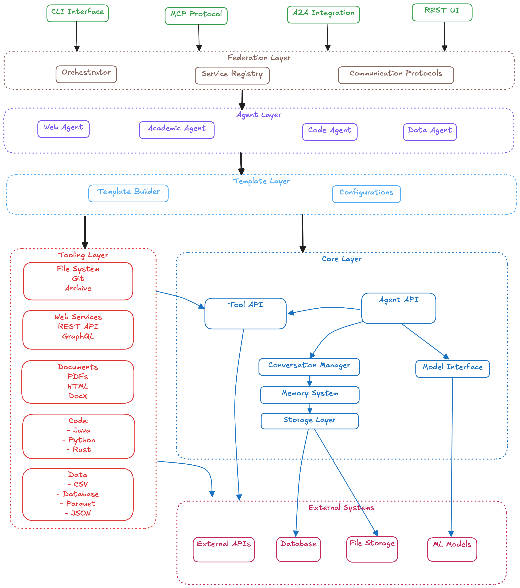

# Kowalski

> [!IMPORTANT]
> ## WIP 1.1.x - Horde & Hardening Phase
> Kowalski is currently in an active refactoring and hardening phase.
> The project is moving from an original proof-of-concept/proof-of-knowledge stage toward a near-production release line.
> During this transition, some modules, commands, and docs may still evolve quickly.
> We are focused on stability, clearer module boundaries, production-ready operator workflows, and robust multi-agent federation.

**Version 1.1.0** · Rust workspace (`kowalski-core`, `kowalski-cli`, `kowalski-mcp-datafusion`, Vue `ui/`)

> "AI agents are like pets – they're cute, but they make a mess."  
> "The future is modular, and so is Kowalski. Want a feature? Open an issue or submit a PR!"

A sophisticated Rust-based multi-agent framework for interacting with various LLM providers (Ollama, OpenAI-compatible APIs), with MCP tool integration, optional PostgreSQL memory (**pgvector**, **Apache AGE** graph queries), federation hooks, and a small **Vue** operator UI backed by **`kowalski`**.

---


## Horde changes in 1.1.0 (since 1.0.0)

- Added the **Knowledge Compiler** as the first horde-style app workflow (ingest -> compile -> ask -> lint) with markdown-native artifacts.
- Added markdown-defined sub-agent orchestration (`main-agent.md` + `agents/*.md`) and validation/run operators.
- Added federation delegate/worker execution with task progress and final artifact reporting.
- Improved operator UX for horde runs in CLI and UI with clearer traceability.

---


## 🌟 Vision & Architecture
Kowalski is designed as a foundational framework for building intelligent, distributed agent systems that can collaborate securely and efficiently. The architecture supports both standalone operation and federated deployments with advanced privacy-preserving capabilities.

**Operational philosophy:** Prefer **simple, robust defaults** with **minimal moving parts** (fewer required services and dependencies). Early work used **Qdrant** as a **proof of concept** for vector memory; the ongoing direction is **dependency-light** core paths—see [`docs/DESIGN_MEMORY_AND_DEPENDENCIES.md`](docs/DESIGN_MEMORY_AND_DEPENDENCIES.md).




```
kowalski/
├── kowalski-core/           # Agents, LLM providers, memory, MCP client, federation types
├── kowalski-cli/            # REPL, config/db/mcp tools
├── kowalski/                # HTTP API server binary (`kowalski`)
├── kowalski-mcp-datafusion/ # Standalone MCP server: DataFusion SQL over CSV/Parquet
├── ui/                      # Vue 3 + Vite operator UI (Chat, MCP, federation, graph status)
├── migrations/
│   ├── postgres/            # SQL migrations when using Postgres memory
│   └── legacy_prompts/      # Stashed prompts from legacy specialized agents
├── resources/               # Configs, tokenizer, etc.
└── docs/                    # Design notes, architecture
```

---

## 📦 Module Overview

### **kowalski-core**
- Foundational types, agent abstractions, conversation, roles, configuration, error handling, toolchain logic.
- Includes `TemplateAgent` for building configurable agents.
- Designed for extensibility and async-first operation.
- [See details](./kowalski-core/README.md)

### **kowalski-cli**
- The command-line interface: `chat`, `run`, `config`, `db migrate`, `doctor`, `mcp ping` / `mcp tools`.

### **kowalski**
- The HTTP API server binary: `kowalski` (HTTP JSON API on `127.0.0.1:3456` by default).
- Build with **`--features postgres`** for SQL memory + pgvector bindings and **`POST /api/graph/cypher`** (Apache AGE) on `serve`.

### **kowalski-mcp-datafusion**
- Optional **MCP** server (Streamable HTTP) for **SQL** over local **CSV/Parquet** via **DataFusion**.
- See [`kowalski-mcp-datafusion/README.md`](./kowalski-mcp-datafusion/README.md) and Docker assets in that crate.

### **ui/**
- Vue 3 + Vite operator shell: health, MCP ping, **Chat** (SSE including **tool-aware stream**), federation, graph extension status.
- Dev: `cd ui && bun install && bun run dev` (proxies `/api` to the CLI server; see [`ui/README.md`](./ui/README.md)).

---

## 🚀 Installation & Setup

### 1. Prerequisites

- **Rust** (latest stable, [rustup.rs](https://rustup.rs))
- **[Ollama](https://ollama.com/)** if you use the default `[llm] provider = "ollama"` (local models)
- **Optional:** Node 22 + **Bun** for the Vue UI (`ui/`), PostgreSQL + extensions for durable memory / federation (see `TODO.md` and crate `README`s)

### 2. Clone & build

```bash
git clone https://github.com/yarenty/kowalski.git
cd kowalski
cargo build --release
```

Main binaries are **`kowalski-cli`** (`target/release/kowalski-cli`) and **`kowalski`** (`target/release/kowalski`). Adjust `config.toml` in the repo root (or pass `-c` / `--config` where supported) for models, MCP servers, and memory.

### 3. Ollama (typical local setup)

```bash
ollama serve   # in another terminal or as a service
ollama pull llama3.2   # or another tag matching `[ollama].model` in config.toml
```

### 4. Quick checks

```bash
./target/release/kowalski-cli doctor
./target/release/kowalski-cli config check
```

---

## 🛠️ Usage

### CLI (examples)

Tools and MCP are driven by **`TemplateAgent`** + config, not separate `kowalski tool …` / academic subcommands.

```bash
# Help (binary name is kowalski-cli)
./target/release/kowalski-cli --help

# Orchestrator REPL (TemplateAgent + tools; uses config.toml by default)
./target/release/kowalski-cli run -c config.toml

# HTTP API for the Vue UI (default bind 127.0.0.1:3456)
./target/release/kowalski -c config.toml

# MCP servers from config: initialize + tools/list
./target/release/kowalski-cli mcp ping -c config.toml
./target/release/kowalski-cli mcp tools -c config.toml

# Apply SQL migrations when using sqlite: or postgres:// memory URLs
./target/release/kowalski-cli db migrate --url 'postgres://…'
# or: db migrate -c config.toml

# Interactive / legacy agent manager flow (create agents, then chat by name)
./target/release/kowalski-cli --interactive
./target/release/kowalski-cli create web
./target/release/kowalski-cli chat my-agent-name
```

Build with **`--features postgres`** on `kowalski` for Postgres memory and graph routes (`cargo build -p kowalski --features postgres`).

### Vue UI (`ui/`)

The web UI lives in **[`ui/`](./ui/)** at the repository root (Vue 3 + Vite). It talks to the backend via **`kowalski`**: the dev server proxies **`/api`** to **`http://127.0.0.1:3456`** (see `ui/vite.config.ts`).

**Two terminals:**

```bash
# Terminal 1 — HTTP API (must be up first)
./target/release/kowalski -c config.toml

# Terminal 2 — Vite (default http://localhost:5173)
cd ui && npm install && npm run dev
```

Production build: `cd ui && npm run build` (static assets under `ui/dist/`). More detail: [`ui/README.md`](./ui/README.md) and [`ui/DEPLOY.md`](./ui/DEPLOY.md).

### Rust API (minimal)

```rust
use kowalski_core::agent::Agent;
use kowalski_core::config::Config;
use kowalski_core::template::TemplateAgent;

#[tokio::main]
async fn main() -> Result<(), Box<dyn std::error::Error>> {
    let config = Config::default();
    let model = config.ollama.model.clone();
    let mut agent = TemplateAgent::new(config).await?;
    let conv = agent.start_conversation(&model);
    let reply = agent.chat_with_history(&conv, "Hello", None).await?;
    println!("{reply}");
    Ok(())
}
```

---

## 🤖 Existing Agents & How to Run

Kowalski formerly utilized dedicated agent crates (`kowalski-web-agent`, `kowalski-code-agent`, etc.). These have been unified into a single `TemplateAgent` located in `kowalski-core`.

To run specific agent functional "personas" (like `web` or `code`), you can supply the persona name to the CLI, which will load the respective system prompt and configuration dynamically:

```bash
cargo run --release --bin kowalski-cli
kowalski> create code
kowalski> chat code-agent
```

Legacy prompt configurations are currently stored in `migrations/legacy_prompts/`.

---

## 📖 Documentation & Links

- [CHANGELOG.md](./CHANGELOG.md)
- [ROADMAP.md](./ROADMAP.md)
- **[TODO.md](./TODO.md)** — manual & end-to-end verification (operator checklist)
- **[`ui/README.md`](./ui/README.md)** — Vue operator UI (dev, build, proxy to `kowalski`)
- [Each module's README](./kowalski-core/README.md), etc.

---

## 🤝 Contributing

> "Contributing is like dating – it's fun until someone suggests changes." – An Open Source Maintainer

- PRs, issues, and feature requests are welcome!
- Please add tests and update docs.
- See [CONTRIBUTING.md](./CONTRIBUTING.md) if available.

---

## 📝 License

> "Licenses are like prenuptial agreements – they're boring until you need them." – A Lawyer

MIT License. See [LICENSE](./LICENSE).

---

## 🙏 Acknowledgments

> "Acknowledgments are like thank you notes – they're nice but nobody reads them." – A Grateful Developer

- Thanks to the Ollama team and all open source contributors.
- Thanks to my coffee machine for keeping me awake during development.
- Thanks to everyone who opens an issue, even if it's just to say "it doesn't work".

---

## 📈 Activity


---

**For the latest features, roadmap, and future plans, see [ROADMAP.md](./ROADMAP.md).**
