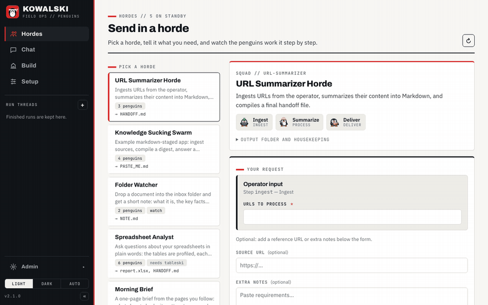
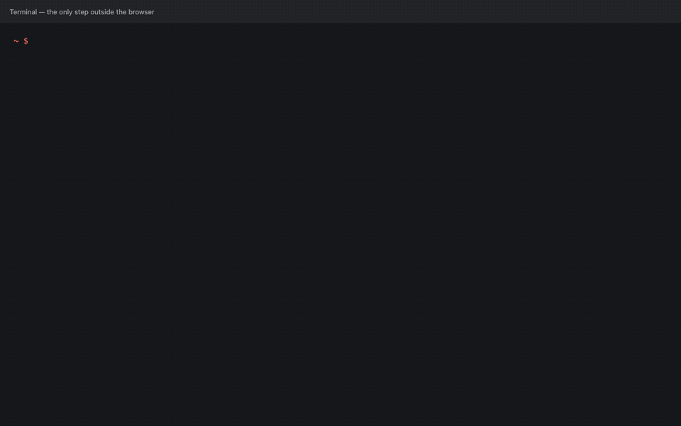

# Kowalski

> "Kowalski, analysis!"

**Hordes of small AI agents that do real work on your machine.** Kowalski is one binary: download
it, answer three setup questions, and give your spreadsheets, pages and documents to a horde.
The answers come back as files you can open: a report workbook, a morning brief, a note with
deadlines. Your model (local Ollama, or any OpenAI-compatible endpoint with your key), your files,
your machine.



*Three questions to the Spreadsheet analyst, on a local 7B model; the minutes it spends thinking are
cut from the recording.*

**Current release: 2.6 — Field Notes.** What changed and when: [CHANGELOG.md](CHANGELOG.md) ·
what is next: [ROADMAP.md](ROADMAP.md).

---

## Install

**Mac:** download [**Kowalski.dmg**](https://github.com/yarenty/kowalski/releases/latest/download/Kowalski.dmg),
open it, drag **Kowalski** to Applications and open it. It starts kowalski and opens your
browser; quit it from the Dock to stop. Apple Silicon and Intel, signed and notarized.

**Mac or Linux, from a terminal:**

```bash
curl -fsSL https://raw.githubusercontent.com/yarenty/kowalski/main/install.sh | bash
kowalski
```

macOS and Linux, Intel or ARM. The installer downloads the pre-built `kowalski` and `kowalski-cli`
from the latest release into `~/.local/bin` and checks their checksum; no Rust needed. `kowalski`
opens the app in your browser, where Setup asks for:

1. **A model** — Ollama if it is running (its models are listed), or an OpenAI-compatible endpoint
   and key. A Check button tests it without spending tokens.
2. **A files folder** — the only place the agents' file tools may read and write.
3. **tableski** (optional) — sign in and your spreadsheets become SQL tables the agents can query.

Setup writes the config and restarts the server. The archives are also on the
[releases page](https://github.com/yarenty/kowalski/releases).

A first run, start to finish: the installer, Setup's three questions, signing in to tableski, a
workbook dropped on the Spreadsheet analyst and its answers (the model's time is sped up; the
tableski sign-in itself is not shown):



<details>
<summary>Installer options</summary>

| Variable | Effect |
|----------|--------|
| `KOWALSKI_BIN_DIR=~/.local/bin` | Where the binaries go |
| `KOWALSKI_RELEASE=v2.6.0` | A specific release instead of the latest |
| `KOWALSKI_FROM_SOURCE=1` | Build from crates.io with cargo instead (no UI inside) |
| `KOWALSKI_VERSION=2.6.0` | crates.io version (source build) |
| `KOWALSKI_FEATURES=postgres` | `cargo install --features postgres` (source build) |
| `KOWALSKI_INSTALL_MCP=1` | Also install `kowalski-mcp-rookery` (source build) |
| `KOWALSKI_SKIP_RUSTUP=1` | Fail instead of auto-installing Rust (source build) |

</details>

---

## What a horde does for you

Five hordes ship inside the binary and appear in the Hordes screen on first start.

| Horde | You give it | You get |
|---|---|---|
| **Spreadsheet analyst** | Questions in plain words, about workbooks loaded in tableski | `report.xlsx` (one sheet per question) and `HANDOFF.md` with short answers. The model writes SQL; every number comes from the query engine. |
| **Morning brief** | The pages you check every morning | `BRIEF.md`: a top pick and the items worth your time from each page, with links. A weekday 7:00 schedule is ready to switch on. |
| **Folder watcher** | Documents dropped into its `inbox/` | `NOTE.md`: what the document is, the key facts, and what to do by when. |
| **URL summarizer** | A list of links | A short summary per page. |
| **Knowledge compiler** | Articles, repos, notes | A compiled knowledge pack you can ask questions of. |

Scheduled and watching hordes ship switched off: nothing runs, or costs, until you turn it on.
Steps that would run a command or write into a project stop and ask for your approval first.

Try the analyst from a terminal against a running server:

```bash
examples/spreadsheet-analyst/demo.sh "Who spent the most?" "How many customers per city?"
```

## Your spreadsheets: tableski

The Spreadsheet analyst reads your workbooks through [tableski](https://tableski.io), which turns
every sheet into a SQL table an AI can query. Use the hosted service or run it yourself:

- **Hosted at tableski.io.** In Setup, **Connect tableski** signs you in once in the browser (no
  card, no token to copy); kowalski keeps the sign-in fresh. Then drop a workbook on the
  **Workbooks** card of the analyst's page and ask.
- **Your own tableski.** Start the local binary with your file, `tableski --file report.xlsx`, and
  point kowalski at it; nothing leaves your machine.

Setup writes the config for you. By hand, it is one block in `config.toml`, with a token from
[tableski.io/app/tokens](https://tableski.io/app/tokens) or, for a local tableski, the local
address and no token:

```toml
[[mcp.servers]]
name = "tableski"
url = "https://mcp.tableski.io/"      # local: "http://127.0.0.1:8080/"
transport = "http"
headers = { Authorization = "Bearer tsk_your_token" }
```

New to tableski? Its [five-minute demo](https://github.com/yarenty/tableski/tree/main/demo)
loads a workbook and asks the first question.

## Make your own

A horde is a folder of Markdown: `horde.md` (the pipeline and its triggers), `agents/*.md` (one
file per step: what kind of step, what it reads, where it writes) and `prompts/`. Copy a built-in
one next to your config and change it, or describe what you want in the **Rookery** tab and let
the builder write the folder. Hordes can run on a schedule, when a file lands, or from a webhook,
and travel between machines as a single `.kwf.zip` bundle.

---

## How it works


One process holds the operator UI, the HTTP API, the horde runner and the agent core. Runs are
durable (every state change goes to SQLite, and runs survive restarts). Tools are a small built-in
set (`web_fetch`, `web_search`, files) plus anything that speaks MCP, starting with
[tableski](https://github.com/yarenty/tableski). Deterministic steps do the work models are bad
at — fetching, profiling tables, running SQL, building workbooks — so a small local model only
has to write a query or a paragraph from material it has been given.

The full picture, with diagrams of one run and the run lifecycle:
**[docs/architecture.html](docs/architecture.html)**.

---

## Build from source

```bash
git clone https://github.com/yarenty/kowalski.git && cd kowalski
(cd ui && bun install && bun run build)      # the UI is compiled into the server
cargo build --release
./target/release/kowalski                    # http://127.0.0.1:3456, opens your browser
```

Rust stable and [Bun](https://bun.sh) for the UI; [Ollama](https://ollama.com) if you want a local
model. [`config.example.toml`](config.example.toml) documents every setting; your own
`config.toml` is git-ignored. Build with `--features postgres` for Postgres memory (pgvector) and
graph queries.

| Command | What it does |
|---|---|
| `kowalski` | Server with the UI (`--bind`, `--no-open`, `--auth`) |
| `kowalski-cli` / `kowalski-cli chat` | Terminal chat with your model and MCP tools |
| `kowalski-cli agent-app export <horde>` / `import <bundle>` | Move a horde as one file |
| `kowalski-cli mcp ping` / `mcp tools` | Check the MCP servers in your config |
| `kowalski-cli doctor` | Environment check |

**UI development:** run `kowalski`, then `cd ui && bun run dev` (Vite on :5173 proxies `/api`).
See [`ui/README.md`](ui/README.md).

**Security defaults:** no token is needed on 127.0.0.1; bound to any other address the API
always requires the bearer token printed at first start. Imported hordes run their steps in a
separate process with triggers switched off.

### Rust API

```rust
use kowalski_core::agent::Agent;
use kowalski_core::config::Config;
use kowalski_core::template::TemplateAgent;

#[tokio::main]
async fn main() -> Result<(), Box<dyn std::error::Error>> {
    let config = Config::default();
    let model = config.ollama.model.clone();
    let mut agent = TemplateAgent::new(config).await?;
    let conv = agent.start_conversation(&model);
    let reply = agent.chat_with_history(&conv, "Hello", None).await?;
    println!("{reply}");
    Ok(())
}
```

### Workspace

| Crate | Role |
|---|---|
| [`kowalski`](kowalski/) | The server binary: HTTP API, horde runner, triggers, Setup, embedded UI and hordes |
| [`kowalski-core`](kowalski-core/) | Agents, model providers, tools, MCP client, memory, step handlers, bundles |
| [`kowalski-cli`](kowalski-cli/) | Terminal chat, bundles, MCP checks, isolated step runner |
| [`kowalski-mcp-rookery`](kowalski-mcp-rookery/) | The horde builder as an MCP server |
| [`ui/`](ui/) | Vue 3 operator UI |

### Ecosystem

| Project | What it is |
|---|---|
| [**tableski**](https://github.com/yarenty/tableski) | Every spreadsheet is a table: Excel, CSV and Parquet as SQL over MCP. Local binary or hosted at tableski.io. |
| [**emperor-mcp**](https://github.com/yarenty/emperor-mcp) | The MCP server framework first-party servers are built on (stateless HTTP, credential forwarding, output framing). |

New first-party MCP servers get their own repositories on `emperor-mcp`; this repository stays
the runtime.

---

## Documentation

- [kowalski.yarenty.com](https://kowalski.yarenty.com) — the blog
- [docs/architecture.html](docs/architecture.html) — how it is built
- [docs/](docs/README.md) — technical notes (`dev/`), articles (`blog/`), ideas (`concepts/`)
- [examples/](examples/) — every built-in horde, readable as plain files
- [CHANGELOG.md](CHANGELOG.md) · [ROADMAP.md](ROADMAP.md) · [AGENTS.md](AGENTS.md) for contributors and coding agents

## Contributing

> "Contributing is like dating – it's fun until someone suggests changes."

Issues and pull requests are welcome. Please add tests and update the docs that your change makes
wrong.

## License

MIT. See [LICENSE](LICENSE).

> "AI agents are like penguins – they look organised, but it's all improvisation."


