# Kowalski Roadmap & Features (0.5.0+)

> "The future is modular, and so is Kowalski. Want a feature? Open an issue or submit a PR!"

## 🧩 Modular Architecture (since 0.5.0)

Kowalski is now split into clear, focused modules:
- **Core**: Foundational types, agent abstractions, conversation, roles, configuration, error handling, toolchain logic
- **Tools**: Pluggable tools for code, data, web, and document analysis
- **Template**: Agent builder, base agent, and ready-to-use agent templates
- **Federation**: (WIP) Multi-agent orchestration, registry, and protocols
- **Agents**: Specific agents (academic, code, data, web, etc.)
- **CLI**: Command-line interface

---

## Core
- [x] Agent abstraction & base agent
- [x] Conversation and memory management
- [x] Role, audience, preset, and style system
- [x] Tool and toolchain system
- [x] Unified error handling
- [x] Extensible configuration
- [ ] Long-term conversation storage (planned)
- [ ] Conversation search and indexing (planned)
- [ ] Context window management (planned)

## Tools
- [x] CSV/data analysis tool
- [x] Code analysis tools (Java, Python, Rust)
- [x] Web search tool (DuckDuckGo, Serper)
- [x] Web scraping tool (CSS selectors, recursive)
- [x] PDF/document processing tool
- [ ] Support for more document formats (DOCX, EPUB, HTML) (planned)
- [ ] Image processing and OCR (planned)
- [ ] Table extraction and processing (planned)
- [ ] Academic paper processing (citations, figures, LaTeX) (planned)

## Template
- [x] TemplateAgent abstraction
- [x] AgentBuilder for ergonomic construction
- [x] General-purpose agent template
- [x] Research agent template
- [ ] More templates for specific domains (planned)
- [ ] Dynamic tool loading/plugins (planned)

## Federation (Experimental)
- [x] Agent registry and membership
- [x] Role assignment (coordinator, worker, observer)
- [x] Task delegation and assignment
- [x] Message passing and broadcasting
- [ ] Protocol selection (A2A, ACP, MCP, or custom) (open)
- [ ] Secure agent authentication (planned)
- [ ] Persistent registry and orchestrator state (planned)
- [ ] Federation-wide logging and monitoring (planned)

## Agents
- [x] Academic agent
- [x] Code agent
- [x] Data agent
- [x] Web agent
- [ ] More specialized agents (planned)
- [ ] Agent templates for customer support, automation, etc. (planned)

## User Interface & Integration
- [x] CLI interface with rich formatting
- [ ] Web interface (planned)
- [ ] REST API (planned)
- [ ] WebSocket support (planned)
- [ ] Export conversations (PDF, HTML, Markdown) (planned)
- [ ] Slack/Discord/Teams integration (planned)
- [ ] Git/CI/CD integration (planned)

## Security & Privacy
- [ ] End-to-end encryption (planned)
- [ ] Role-based access control (planned)
- [ ] Conversation anonymization (planned)
- [ ] Audit logging (planned)
- [ ] Content filtering (planned)

## Analytics & Monitoring
- [ ] Usage statistics and analytics (planned)
- [ ] Performance monitoring (planned)
- [ ] Cost tracking (planned)
- [ ] Response quality metrics (planned)
- [ ] Error analytics and reporting (planned)

## Advanced Features
- [ ] Multi-language support (planned)
- [ ] Custom prompt templates (planned)
- [ ] Chain-of-thought visualization (planned)
- [ ] Semantic search across conversations (planned)
- [ ] Auto-summarization of long conversations (planned)

## Developer Tools
- [x] Plugin system (basic, planned for expansion)
- [ ] Custom model training tools (planned)
- [x] Debug mode with detailed logging
- [ ] Testing utilities (planned)
- [x] Documentation generator

---

## Long-Term Vision & Open Questions
- **Protocol selection for federation:** A2A, ACP, MCP, or custom?
- **Advanced agent orchestration:** Multi-agent, federated, and plugin-based development
- **Persistent state:** Should agent state and task history be persisted?
- **Security:** How do agents authenticate and authorize each other?
- **Scalability:** What are the bottlenecks for large federations?
- **Extensibility:** How can new agent types and protocols be plugged in?
- **Community:** Encourage contributions, feature requests, and protocol discussions

---

Future architecture (high level):

```mermaid
graph TB
    subgraph "Client Interfaces"
        CLI[CLI Interface]
        REST[REST API Server]
        GRPC[gRPC Server]
        WS_SRV[WebSocket Server]
        WEB_UI[Web Dashboard]
    end
    
    subgraph "Agent Orchestration Layer"
        ORCH[Agent Orchestrator]
        LB[Load Balancer]
        DISC[Service Discovery]
        HEALTH[Health Monitor]
    end
    
    subgraph "Core Agent Types"
        GA[General Agent<br/>Basic Chat & Q&A]
        AA[Academic Agent<br/>Research & Analysis]
        TA[Tooling Agent<br/>Web Search & Tools]
        CA[Code Agent<br/>Programming Tasks]
        DA[Data Agent<br/>Analytics & Viz]
        SEC[Security Agent<br/>Audit & Compliance]
    end
    
    subgraph "Agent Communication"
        A2A[Agent-to-Agent Protocol]
        MSG_BUS[Message Bus<br/>Redis/RabbitMQ]
        EVENTS[Event Store]
        COORD[Coordination Service]
    end
    
    subgraph "Core Services"
        subgraph "Conversation Management"
            CM[Conversation Manager]
            HIST[History Store]
            CTX[Context Manager]
            SESS[Session Manager]
        end
        
        subgraph "Role & Personality"
            RM[Role Manager]
            PERS[Personality Engine]
            PROMPT[Prompt Templates]
        end
        
        subgraph "Streaming & Response"
            SM[Streaming Manager]
            RESP[Response Formatter]
            CACHE[Response Cache]
        end
    end
    
    subgraph "Tool Infrastructure"
        subgraph "Document Processing"
            PDF[PDF Processor]
            TXT[Text Processor]
            DOC[Document Parser]
            OCR[OCR Engine]
        end
        
        subgraph "Web & Search Tools"
            WS[Web Search Engine]
            WF[Web Fetcher]
            SCRAPE[Web Scraper]
            RSS[RSS Reader]
        end
        
        subgraph "Code Tools"
            COMPILE[Code Compiler]
            LINT[Code Linter]
            TEST[Test Runner]
            REPO[Repository Manager]
        end
        
        subgraph "Data Tools"
            DB_CONN[Database Connectors]
            CSV[CSV Processor]
            JSON[JSON Processor]
            VIZ[Data Visualization]
        end
        
        subgraph "MPC Interface"
            MPC_MGR[MPC Manager]
            PRIV_COMP[Private Computation]
            SECURE_AGG[Secure Aggregation]
            KEY_MGR[Key Management]
        end
        
        subgraph "Future Extensions"
            PLUGIN[Plugin System]
            CUSTOM[Custom Tools API]
            EXT_API[External APIs]
            WORKFLOW[Workflow Engine]
        end
    end
    
    subgraph "Federation & Distribution"
        FED_ORCH[Federation Orchestrator]
        NODE_MGR[Node Manager]
        CONSENSUS[Consensus Protocol]
        P2P[P2P Network Layer]
        CRYPTO[Cryptographic Layer]
    end
    
    subgraph "External Services"
        subgraph "LLM Providers"
            OLLAMA[Ollama Server]
            OPENAI[OpenAI API]
            ANTHROPIC[Anthropic API]
            MODELS[Local Models]
        end
        
        subgraph "Search & Web"
            SEARCH_API[Search APIs<br/>Google, Bing, etc.]
            WEB_SRC[Web Sources]
            NEWS[News APIs]
        end
        
        subgraph "Infrastructure"
            DB[(Database<br/>PostgreSQL)]
            REDIS[(Redis Cache)]
            S3[(Object Storage)]
            METRICS[Metrics Store]
        end
    end
    
    subgraph "Security & Monitoring"
        AUTH[Authentication]
        AUTHZ[Authorization]
        AUDIT[Audit Logger]
        MON[Monitoring]
        ALERT[Alerting]
    end
    
    subgraph "Configuration & Management"
        CFG[Configuration Manager]
        ENV[Environment Config]
        SECRETS[Secret Management]
        DEPLOY[Deployment Manager]
    end
    
    %% Client Connections
    CLI --> ORCH
    REST --> ORCH
    GRPC --> ORCH
    WS_SRV --> ORCH
    WEB_UI --> ORCH
    
    %% Orchestration
    ORCH --> LB
    LB --> GA
    LB --> AA
    LB --> TA
    LB --> CA
    LB --> DA
    LB --> SEC
    
    ORCH --> DISC
    ORCH --> HEALTH
    
    %% Agent Communication
    GA --> A2A
    AA --> A2A
    TA --> A2A
    CA --> A2A
    DA --> A2A
    SEC --> A2A
    
    A2A --> MSG_BUS
    A2A --> EVENTS
    A2A --> COORD
    
    %% Core Services
    GA --> CM
    AA --> CM
    TA --> CM
    CA --> CM
    DA --> CM
    SEC --> CM
    
    CM --> HIST
    CM --> CTX
    CM --> SESS
    
    GA --> RM
    AA --> RM
    TA --> RM
    
    RM --> PERS
    RM --> PROMPT
    
    GA --> SM
    AA --> SM
    TA --> SM
    
    SM --> RESP
    SM --> CACHE
    
    %% Tool Connections
    AA --> PDF
    AA --> TXT
    AA --> DOC
    AA --> OCR
    
    TA --> WS
    TA --> WF
    TA --> SCRAPE
    TA --> RSS
    
    CA --> COMPILE
    CA --> LINT
    CA --> TEST
    CA --> REPO
    
    DA --> DB_CONN
    DA --> CSV
    DA --> JSON
    DA --> VIZ
    
    SEC --> MPC_MGR
    MPC_MGR --> PRIV_COMP
    MPC_MGR --> SECURE_AGG
    MPC_MGR --> KEY_MGR
    
    %% Plugin System
    PLUGIN --> CUSTOM
    PLUGIN --> EXT_API
    PLUGIN --> WORKFLOW
    
    %% Federation
    ORCH --> FED_ORCH
    FED_ORCH --> NODE_MGR
    FED_ORCH --> CONSENSUS
    FED_ORCH --> P2P
    FED_ORCH --> CRYPTO
    
    %% External Services
    GA --> OLLAMA
    AA --> OLLAMA
    TA --> OLLAMA
    CA --> OLLAMA
    DA --> OLLAMA
    SEC --> OLLAMA
    
    GA --> OPENAI
    AA --> ANTHROPIC
    
    WS --> SEARCH_API
    WF --> WEB_SRC
    RSS --> NEWS
    
    %% Data Storage
    CM --> DB
    HIST --> DB
    EVENTS --> DB
    CACHE --> REDIS
    RESP --> S3
    
    %% Security
    REST --> AUTH
    GRPC --> AUTH
    AUTH --> AUTHZ
    AUDIT --> DB
    MON --> METRICS
    MON --> ALERT
    
    %% Configuration
    ORCH --> CFG
    CFG --> ENV
    CFG --> SECRETS
    CFG --> DEPLOY
    
    %% Styling
    style ORCH fill:#ff9800
    style GA fill:#e1f5fe
    style AA fill:#f3e5f5
    style TA fill:#e8f5e8
    style CA fill:#fff3e0
    style DA fill:#e0f2f1
    style SEC fill:#fce4ec
    style FED_ORCH fill:#f1f8e9
    style MPC_MGR fill:#e8eaf6
    style PLUGIN fill:#fff8e1
```

---
**Legend:**
- [x] Implemented
- [ ] Planned / In Progress / Experimental

> "The future is modular, and so is Kowalski. Want a feature? Open an issue or submit a PR!"