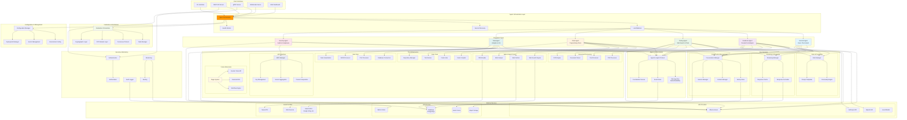

# Kowalski Roadmap & Features (1.4.0+)

> "The future is modular, and so is Kowalski. Want a feature? Open an issue or submit a PR!"

**Release:** **1.4.0** on `main` (source merge 2026-06-15) — see [`CHANGELOG.md`](CHANGELOG.md). **crates.io:** still **1.3.0** until **1.5.0** publish.  
**Per-crate roadmaps:** [`kowalski-core/ROADMAP.md`](kowalski-core/ROADMAP.md), [`kowalski-cli/ROADMAP.md`](kowalski-cli/ROADMAP.md), [`kowalski-mcp-datafusion/ROADMAP.md`](kowalski-mcp-datafusion/ROADMAP.md), [`ui/ROADMAP.md`](ui/ROADMAP.md).

## Shipped in 1.3.0 (2026-06-14)

See [`CHANGELOG.md`](CHANGELOG.md) (**[1.3.0]**). Highlights: **Rookery** horde builder (core + `/api/rookery/*` + Vue tab), **`kowalski-mcp-rookery`** + **`kowalski-mcp-transport`** (stateless Streamable HTTP), Docker MCP gateway, server-owned Rookery sessions (YAML), penguin avatars, server-validated horde operator forms, A2A federation-edge design note (implementation 1.4/1.5).

## Shipped in 1.2.0 (2026-05-03)

See [`CHANGELOG.md`](CHANGELOG.md) (**[1.2.0]**). Highlights: Knowledge Compiler **`workdir/debug/`** layout without **`derived/`** (`raw`, `reports`, `lint`, `followups`), horde HTTP conventions **`agents_log`** + **`debug/followups/`**, GitHub-aware **`source_bundle`**, **`horde.md`-only** `agent-app`, operator docs and UI smoke guidance.

## Planned: Rookery horde builder (1.3.0) — **shipped**

Canonical plan: **this file** ([`ROADMAP.md`](ROADMAP.md) § *Planned: Rookery* / *1.3.x cleanup*).

- [x] **`kowalski-core::rookery`** — draft schema, validate, write `horde.md` + `agents/` + `prompts/` tree.
- [x] **`/api/rookery/*`** — interview chat, propose, **Give birth** (linear pipeline only).
- [x] **UI Rookery tab** — conversational builder + summary + birth; linear penguin canvas + per-penguin editor + structured form (Phases 4–6 in plan).
- **Topology:** **linear** `pipeline = [...]` only (same as Knowledge Compiler today).

### 1.3.x — Cleanup + reposition (architectural debt)

The builder shipped, but the UI absorbed core responsibilities. Pay down before resuming Phase 7–9 (details in **§1.3.x cleanup** below):

- [x] **R1** Server owns the Rookery draft — dropped the `localStorage` draft round-trip; sessions persist as YAML under `db/rookery/` and reload on startup. UI is render + dispatch only.
- [x] **R2** Rookery as an **in-repo MCP server** (`kowalski-mcp-rookery`, stdio) over `kowalski-core::rookery`; `/api/rookery/*` and the new server share the same core primitives (any MCP client can build hordes). LLM-free — the calling agent drives the interview.
- [x] **R3** **Docker MCP gateway** as one stdio MCP server (`docker mcp gateway run`); dynamic mode + `--servers`/`--profile` direct mode. `tools/internal/*` stay the dependency-light fallback, shadowed by the gateway when present.
- [x] **Transport** Shared `kowalski-mcp-transport` (stdio + **stateless Streamable HTTP**, no `Mcp-Session-Id`) — adopted by `kowalski-mcp-rookery` (`--transport stdio|http`) and `kowalski-mcp-datafusion` (now sessionless), so every in-repo MCP server is reachable over stateless HTTP.

## Shipped in 1.4.0 (2026-06-15, source merge)

See [`CHANGELOG.md`](CHANGELOG.md) (**[1.4.0]**). Highlights: **`edges[]` / `[[edges]]`**, graph validation + orchestrator scheduling, Rookery DAG birth, UI fork/join canvas, **`install.sh`**, [`examples/coding-assistant/`](examples/coding-assistant/), federation worker stage kinds. **Not on crates.io** — next publish **1.5.0**.

## Planned: DAG horde pipelines (1.4.0) — **shipped (MVP)**

- [x] Draft/manifest **`edges[]`** (dependencies, parallel branches, join points).
- [x] Horde orchestrator schedules by graph (`execution_order` / `next_ready_step`).
- [x] Rookery UI canvas: fork/join + read-only edge list; builder prompt for branches.
- [x] Example horde: [`examples/coding-assistant/`](examples/coding-assistant/) (replaces minimal `dag-demo` fork/join smoke).

Existing linear hordes remain valid without migration. **MVP limits:** acyclic graphs only; ready steps run **sequentially** within a layer; federation workers are **markdown-only** (no repo tools).

## Planned: Coding assistant horde — **execution tier** (1.5+)

**Reference app (planning tier, shipped 1.4):** [`examples/coding-assistant/`](examples/coding-assistant/) — operator form (project path + task) → parallel **warmup** / **todo-plan** → **adjust** → fixed dev/test/review chain → `HANDOFF.md`. Validates DAG UX and federation scheduling; **does not** edit the target repo or run tests.

**Goal (1.5+):** Same horde shape, but stages can **read the project tree**, **apply patches**, **run verification**, and **loop** until acceptance criteria pass.

### Architecture (unchanged)

- Thin UI / thick **kowalski-core**; orchestrator-mediated handoff only (no penguin-to-penguin messaging).
- Optional **MCP** tools per stage (`tool_ids` on born agents); federation worker must gain a tool-enabled execution path (today: `chat_no_tools` only).

### Delivery slices

| Slice | Target | Scope |
|-------|--------|--------|
| **CA-1** | 1.5.0 | **Project tree ingest** — walk local project root (respect `.gitignore`, caps), bundle into intake artifact; directory paths in operator form |
| **CA-2** | 1.5.0 | **Tool-enabled horde stages** — federation worker runs MCP / internal FS tools; `tool_ids` wired from agent frontmatter; sandbox roots = operator project path |
| **CA-3** | 1.5.x | **Apply + verify stages** — patch writer (unified diff apply or MCP edit), subprocess test runner (`cargo test`, etc.), structured pass/fail artifact |
| **CA-4** | 1.5.x | **Conditional routing** — orchestrator reads stage artifact (e.g. `status: fail`) and schedules **review → dev** retry without a static pipeline explosion |
| **CA-5** | 1.6+ | **Dynamic sub-pipeline** — todo-plan spawns N dev steps or loop construct in graph schema (requires CA-4 + schema work) |
| **CA-6** | 1.5+ | **UI** — project picker, live test output in Horde run feed, retry/approve gates |

### CA-1 — Project tree ingest (core)

- [ ] `source_bundle`: directory walk with max files/bytes and ignore rules
- [ ] Operator form field type `path` (optional) with server validation
- [ ] Intake artifact: manifest of files + selected contents for warmup

### CA-2 — Tool-enabled stages (core + CLI)

- [ ] `agent-app worker`: optional `--tools` / honor `tool_ids` from agent spec
- [ ] Tool sandbox: restrict FS MCP to `project_path` from run record
- [ ] Chat stream with tool loop (reuse `/api/chat` tool path or in-process TemplateAgent)

### CA-3 — Apply + verify

- [ ] Stage kind `verify` (or extend `process`) — run configured command, capture stdout/stderr into artifact
- [ ] Stage kind `apply` — apply planned diff with dry-run default
- [ ] Document operator approval before apply (HTTP gate or UI checkbox)

### CA-4 — Conditional edges

- [ ] Artifact convention: `{ "status": "pass"|"fail", "next": "dev-1"|"summary" }` or frontmatter in markdown
- [ ] `horde_graph`: optional labeled edges + orchestrator branch selection (design + tests)
- [ ] Reject cycles unless explicitly marked as **loop** construct

### CA-5 — Dynamic steps (defer)

- [ ] Orchestrator interprets todo artifact and enqueues extra `dev-*` delegates
- [ ] Or: graph **loop node** with max iterations (design TBD)

### Success criteria (execution tier)

1. Operator points at local Rust repo + task; horde produces applied changes on disk (with approval).
2. `cargo test` (or configured command) runs in **test-verify**; failure routes to **review → dev** at least once.
3. Linear + DAG hordes without tools unchanged.

**Related:** [`examples/rust-project-scaffolder/`](examples/rust-project-scaffolder/) (linear greenfield planning); Knowledge Compiler (URL ingest). **Out of scope:** penguin-to-penguin A2A (see federation-edge design doc).

**Design-only for now** (see [`docs/DESIGN_A2A_FEDERATION_EDGE.md`](docs/DESIGN_A2A_FEDERATION_EDGE.md)). Penguins inside a horde stay **orchestrator-mediated** (sequential/DAG + artifact handoff); the homegrown ACL (`federation/acl.rs`) stays the **internal** bus. A2A is adopted only as the **external** node↔node skin:

- [ ] Each Kowalski node publishes an **A2A Agent Card** and accepts A2A tasks.
- [ ] A2A task lifecycle maps onto `AclMessage`; an A2A endpoint delegates into the existing orchestrator.
- [ ] **No** penguin-to-penguin A2A — that handoff stays files + orchestrator.

## Horde changes in 1.1.0 (since 1.0.0)

- First complete **Knowledge Compiler horde** app flow (ingest -> compile -> ask -> lint).
- Markdown-defined agent topology and execution (`horde.md`, `agents/*.md`, `agent-app` commands).
- Federation delegate/worker path with task progress publishing and artifact-bearing task results.
- UI federation timeline updates for operator visibility during horde runs.

## Horde & app extensions (1.1.0)

- [x] **Knowledge Compiler** example (`examples/knowledge-compiler`) — ingest → compile → ask → lint, Obsidian-style **`wiki/`** outputs.
- [x] Markdown agent definitions (`horde.md`, `agents/*.md`) + CLI validation before run.
- [x] **`kowalski-cli`**: `extension` dispatch + **`agent-app`** (list / validate / run / delegate / worker / proof).
- [x] Federation **task progress** + **task results** for delegate/worker apps (artifact paths in outcomes).

## Modular architecture (1.1.0 baseline)

**Design emphasis:** Prefer **simple, robust** components and **few required services**—see [`docs/DESIGN_MEMORY_AND_DEPENDENCIES.md`](docs/DESIGN_MEMORY_AND_DEPENDENCIES.md) (note on **Qdrant** as early **PoC** for vector memory).

Workspace layout:
- **kowalski-core**: `TemplateAgent`, LLM providers, memory, MCP client/hub, federation types; optional **Postgres** + **pgvector** + **Apache AGE** helpers.
- **kowalski-cli**: REPL and operator commands (`run`, `config`, `db`, `doctor`, `mcp`, **`extension`**, **`agent-app`**).
- **kowalski**: HTTP API server binary (`kowalski`, default `127.0.0.1:3456`) — **`/api/*`** for the Vue UI and integrations.
- **kowalski-mcp-datafusion**: standalone **MCP** Streamable HTTP server (DataFusion over CSV/Parquet).
- **ui**: Vue 3 + Vite operator UI (Chat / MCP / federation / graph status).
- **Legacy prompts**: `migrations/legacy_prompts/` (staged).

---

## Core
- [x] Agent abstraction & base agent
- [x] Conversation and memory management
- [x] Role, audience, preset, and style system
- [x] Tool and toolchain system
- [x] Unified error handling
- [x] Extensible configuration
- [ ] Long-term conversation storage (planned)
- [ ] Conversation search and indexing (planned)
- [ ] Context window management (planned)

## Tools
- [x] CSV/data analysis tool
- [x] Code analysis tools (Java, Python, Rust)
- [x] Web search tool (DuckDuckGo, Serper)
- [x] Web scraping tool (CSS selectors, recursive)
- [x] PDF/document processing tool
- [ ] Support for more document formats (DOCX, EPUB, HTML) (planned)
- [ ] Image processing and OCR (planned)
- [ ] Table extraction and processing (planned)
- [ ] Academic paper processing (citations, figures, LaTeX) (planned)

## Template
- [x] TemplateAgent abstraction
- [x] AgentBuilder for ergonomic construction
- [x] General-purpose agent template
- [x] Research agent template
- [ ] More templates for specific domains (planned)
- [ ] Dynamic tool loading/plugins (planned)

## Federation (Experimental)
- [x] Agent registry and membership
- [x] Role assignment (coordinator, worker, observer)
- [x] Task delegation and assignment
- [x] Message passing and broadcasting
- [x] In-process + SSE broker; optional Postgres `LISTEN`/`NOTIFY` bridge (see `kowalski` with `--features postgres`)
- [ ] Protocol selection (A2A, ACP, MCP, or custom) (open)
- [ ] Secure agent authentication (planned)
- [x] Persistent registry records (Postgres-backed when configured)
- [ ] Federation-wide logging and monitoring (planned)

## Agents
- [x] Academic agent
- [x] Code agent
- [x] Data agent
- [x] Web agent
- [ ] More specialized agents (planned)
- [ ] Agent templates for customer support, automation, etc. (planned)

## User Interface & Integration
- [x] CLI interface with rich formatting
- [x] Vue operator UI (`ui/`) + **`kowalski`** HTTP API
- [x] REST-style JSON API under `/api/*` (chat, stream, MCP, federation, graph)
- [x] WebSocket `/api/federation/ws` (and SSE stream) where enabled
- [x] Federation UI: horde-style run flow + **task progress** timeline for app delegates (1.1.0)
- [ ] Export conversations (PDF, HTML, Markdown) (planned)
- [ ] Slack/Discord/Teams integration (planned)
- [x] CI: GitHub Actions (Postgres pgvector + dedicated **Apache AGE** job)

## Security & Privacy
- [ ] End-to-end encryption (planned)
- [ ] Role-based access control (planned)
- [ ] Conversation anonymization (planned)
- [ ] Audit logging (planned)
- [ ] Content filtering (planned)

## Analytics & Monitoring
- [ ] Usage statistics and analytics (planned)
- [ ] Performance monitoring (planned)
- [ ] Cost tracking (planned)
- [ ] Response quality metrics (planned)
- [ ] Error analytics and reporting (planned)

## Advanced Features
- [ ] Multi-language support (planned)
- [ ] Custom prompt templates (planned)
- [ ] Chain-of-thought visualization (planned)
- [ ] Semantic search across conversations (planned)
- [ ] Auto-summarization of long conversations (planned)

## Developer Tools
- [x] Plugin system (basic, planned for expansion)
- [ ] Custom model training tools (planned)
- [x] Debug mode with detailed logging
- [ ] Testing utilities (planned)
- [x] Documentation generator

---

## Long-Term Vision & Open Questions
- **Protocol selection for federation:** A2A, ACP, MCP, or custom?
- **Advanced agent orchestration:** Multi-agent, federated, and plugin-based development
- **Persistent state:** Should agent state and task history be persisted?
- **Security:** How do agents authenticate and authorize each other?
- **Scalability:** What are the bottlenecks for large federations?
- **Extensibility:** How can new agent types and protocols be plugged in?
- **Community:** Encourage contributions, feature requests, and protocol discussions

---

Future architecture (high level):

```mermaid
graph TB
    subgraph "Client Interfaces"
        CLI[CLI Interface]
        REST[REST API Server]
        GRPC[gRPC Server]
        WS_SRV[WebSocket Server]
        WEB_UI[Web Dashboard]
    end
    
    subgraph "Agent Orchestration Layer"
        ORCH[Agent Orchestrator]
        LB[Load Balancer]
        DISC[Service Discovery]
        HEALTH[Health Monitor]
    end
    
    subgraph "Core Agent Types"
        GA[General Agent<br/>Basic Chat & Q&A]
        AA[Academic Agent<br/>Research & Analysis]
        TA[Tooling Agent<br/>Web Search & Tools]
        CA[Code Agent<br/>Programming Tasks]
        DA[Data Agent<br/>Analytics & Viz]
        SEC[Security Agent<br/>Audit & Compliance]
    end
    
    subgraph "Agent Communication"
        A2A[Agent-to-Agent Protocol]
        MSG_BUS[Message Bus<br/>Redis/RabbitMQ]
        EVENTS[Event Store]
        COORD[Coordination Service]
    end
    
    subgraph "Core Services"
        subgraph "Conversation Management"
            CM[Conversation Manager]
            HIST[History Store]
            CTX[Context Manager]
            SESS[Session Manager]
        end
        
        subgraph "Role & Personality"
            RM[Role Manager]
            PERS[Personality Engine]
            PROMPT[Prompt Templates]
        end
        
        subgraph "Streaming & Response"
            SM[Streaming Manager]
            RESP[Response Formatter]
            CACHE[Response Cache]
        end
    end
    
    subgraph "Tool Infrastructure"
        subgraph "Document Processing"
            PDF[PDF Processor]
            TXT[Text Processor]
            DOC[Document Parser]
            OCR[OCR Engine]
        end
        
        subgraph "Web & Search Tools"
            WS[Web Search Engine]
            WF[Web Fetcher]
            SCRAPE[Web Scraper]
            RSS[RSS Reader]
        end
        
        subgraph "Code Tools"
            COMPILE[Code Compiler]
            LINT[Code Linter]
            TEST[Test Runner]
            REPO[Repository Manager]
        end
        
        subgraph "Data Tools"
            DB_CONN[Database Connectors]
            CSV[CSV Processor]
            JSON[JSON Processor]
            VIZ[Data Visualization]
        end
        
        subgraph "MPC Interface"
            MPC_MGR[MPC Manager]
            PRIV_COMP[Private Computation]
            SECURE_AGG[Secure Aggregation]
            KEY_MGR[Key Management]
        end
        
        subgraph "Future Extensions"
            PLUGIN[Plugin System]
            CUSTOM[Custom Tools API]
            EXT_API[External APIs]
            WORKFLOW[Workflow Engine]
        end
    end
    
    subgraph "Federation & Distribution"
        FED_ORCH[Federation Orchestrator]
        NODE_MGR[Node Manager]
        CONSENSUS[Consensus Protocol]
        P2P[P2P Network Layer]
        CRYPTO[Cryptographic Layer]
    end
    
    subgraph "External Services"
        subgraph "LLM Providers"
            OLLAMA[Ollama Server]
            OPENAI[OpenAI API]
            ANTHROPIC[Anthropic API]
            MODELS[Local Models]
        end
        
        subgraph "Search & Web"
            SEARCH_API[Search APIs<br/>Google, Bing, etc.]
            WEB_SRC[Web Sources]
            NEWS[News APIs]
        end
        
        subgraph "Infrastructure"
            DB[(Database<br/>PostgreSQL)]
            REDIS[(Redis Cache)]
            S3[(Object Storage)]
            METRICS[Metrics Store]
        end
    end
    
    subgraph "Security & Monitoring"
        AUTH[Authentication]
        AUTHZ[Authorization]
        AUDIT[Audit Logger]
        MON[Monitoring]
        ALERT[Alerting]
    end
    
    subgraph "Configuration & Management"
        CFG[Configuration Manager]
        ENV[Environment Config]
        SECRETS[Secret Management]
        DEPLOY[Deployment Manager]
    end
    
    %% Client Connections
    CLI --> ORCH
    REST --> ORCH
    GRPC --> ORCH
    WS_SRV --> ORCH
    WEB_UI --> ORCH
    
    %% Orchestration
    ORCH --> LB
    LB --> GA
    LB --> AA
    LB --> TA
    LB --> CA
    LB --> DA
    LB --> SEC
    
    ORCH --> DISC
    ORCH --> HEALTH
    
    %% Agent Communication
    GA --> A2A
    AA --> A2A
    TA --> A2A
    CA --> A2A
    DA --> A2A
    SEC --> A2A
    
    A2A --> MSG_BUS
    A2A --> EVENTS
    A2A --> COORD
    
    %% Core Services
    GA --> CM
    AA --> CM
    TA --> CM
    CA --> CM
    DA --> CM
    SEC --> CM
    
    CM --> HIST
    CM --> CTX
    CM --> SESS
    
    GA --> RM
    AA --> RM
    TA --> RM
    
    RM --> PERS
    RM --> PROMPT
    
    GA --> SM
    AA --> SM
    TA --> SM
    
    SM --> RESP
    SM --> CACHE
    
    %% Tool Connections
    AA --> PDF
    AA --> TXT
    AA --> DOC
    AA --> OCR
    
    TA --> WS
    TA --> WF
    TA --> SCRAPE
    TA --> RSS
    
    CA --> COMPILE
    CA --> LINT
    CA --> TEST
    CA --> REPO
    
    DA --> DB_CONN
    DA --> CSV
    DA --> JSON
    DA --> VIZ
    
    SEC --> MPC_MGR
    MPC_MGR --> PRIV_COMP
    MPC_MGR --> SECURE_AGG
    MPC_MGR --> KEY_MGR
    
    %% Plugin System
    PLUGIN --> CUSTOM
    PLUGIN --> EXT_API
    PLUGIN --> WORKFLOW
    
    %% Federation
    ORCH --> FED_ORCH
    FED_ORCH --> NODE_MGR
    FED_ORCH --> CONSENSUS
    FED_ORCH --> P2P
    FED_ORCH --> CRYPTO
    
    %% External Services
    GA --> OLLAMA
    AA --> OLLAMA
    TA --> OLLAMA
    CA --> OLLAMA
    DA --> OLLAMA
    SEC --> OLLAMA
    
    GA --> OPENAI
    AA --> ANTHROPIC
    
    WS --> SEARCH_API
    WF --> WEB_SRC
    RSS --> NEWS
    
    %% Data Storage
    CM --> DB
    HIST --> DB
    EVENTS --> DB
    CACHE --> REDIS
    RESP --> S3
    
    %% Security
    REST --> AUTH
    GRPC --> AUTH
    AUTH --> AUTHZ
    AUDIT --> DB
    MON --> METRICS
    MON --> ALERT
    
    %% Configuration
    ORCH --> CFG
    CFG --> ENV
    CFG --> SECRETS
    CFG --> DEPLOY
    
    %% Styling
    style ORCH fill:#ff9800
    style GA fill:#e1f5fe
    style AA fill:#f3e5f5
    style TA fill:#e8f5e8
    style CA fill:#fff3e0
    style DA fill:#e0f2f1
    style SEC fill:#fce4ec
    style FED_ORCH fill:#f1f8e9
    style MPC_MGR fill:#e8eaf6
    style PLUGIN fill:#fff8e1
```

---
**Legend:**
- [x] Implemented
- [ ] Planned / In Progress / Experimental

> "The future is modular, and so is Kowalski. Want a feature? Open an issue or submit a PR!"