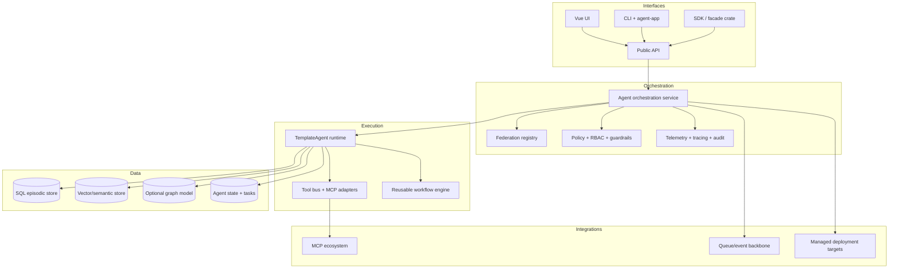

# Architecture v03 (future)

Future-facing architecture sketch for roadmap planning.

- Diagram source: [`img/architecture_v03-future.excalidraw`](./img/architecture_v03-future.excalidraw)
- Current status diagram: [`architecture_v02.md`](./architecture_v02.md)

