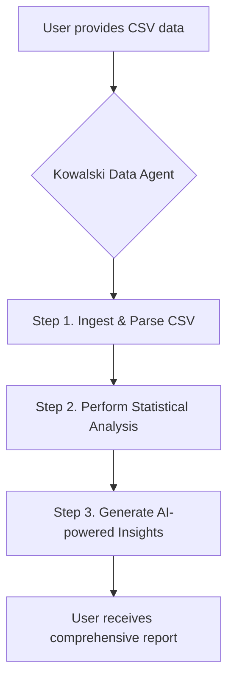
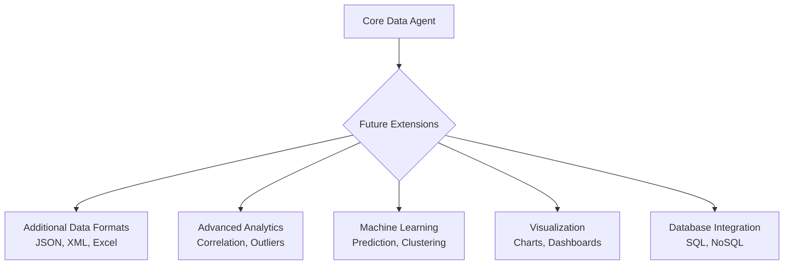
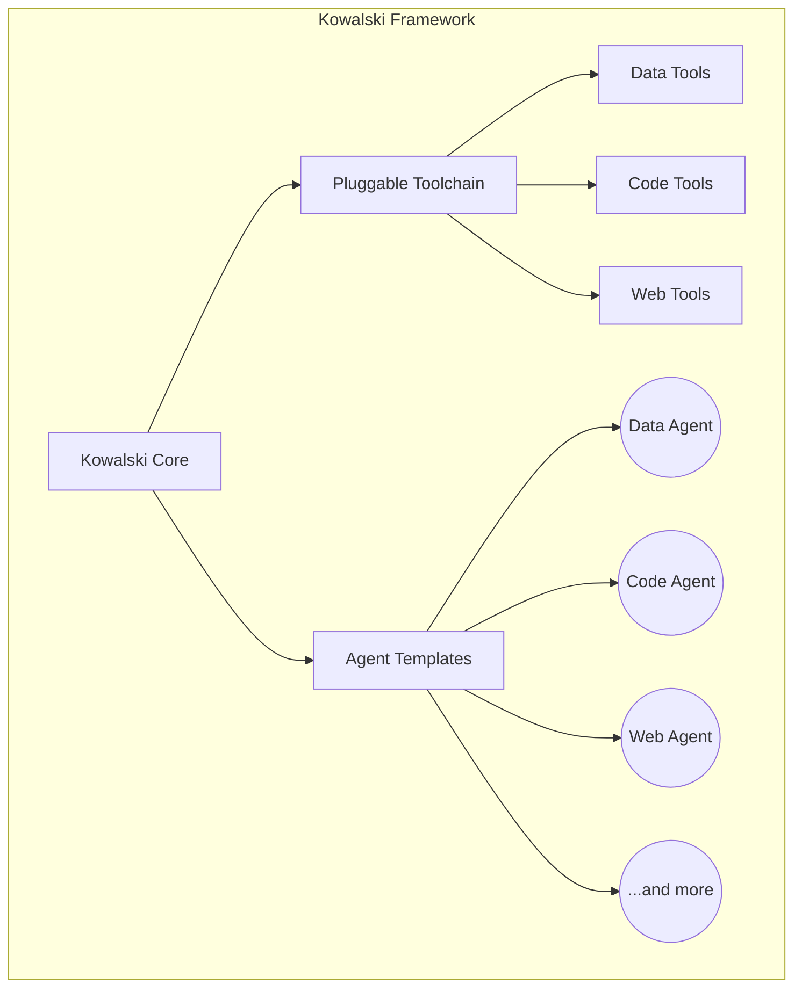

# Meet Your New Automated Data Scientist: The Kowalski Data Agent

**TL;DR:** The Kowalski Data Agent is an AI-powered tool that automates data analysis. It can take a CSV file, instantly provide statistical summaries, and generate human-like insights and recommendations. This makes data science accessible to non-experts and accelerates the work of professionals. The agent is built on a modular, extensible framework with a future roadmap that includes support for more data formats, advanced analytics, machine learning integration, and real-time database connections.

---

In the world of data, speed and accuracy are paramount. Businesses and researchers alike are constantly searching for ways to translate raw numbers into actionable insights faster than ever before. What if you could have a dedicated data scientist on your team, ready to analyze datasets in seconds, uncover hidden patterns, and communicate its findings in plain English? That's not a far-off dream; it's the reality offered by the Kowalski Data Agent.

This sophisticated AI-powered tool is more than just a script; it's an intelligent partner designed to handle the heavy lifting of data analysis. By combining the power of large language models with specialized data processing capabilities, the Data Agent makes sophisticated data science accessible to everyone, regardless of their technical expertise. It can ingest structured data, like a CSV file, and almost instantly deliver a comprehensive report that goes far beyond simple calculations.

## Unlocking Instant Insights from Raw Data

To appreciate the power of the Kowalski Data Agent, let's consider a practical example. We fed it a simple CSV file containing employee data—ten records with details like age, city, salary, and department. The agent didn't just parse the data; it performed a full-blown exploratory analysis.

First, it delivered a statistical summary, providing a foundational understanding of the dataset's structure. It identified the headers, counted the rows and columns, and then broke down each column. For numerical data like 'age' and 'salary', it calculated the average, minimum, maximum, and sum. For categorical data like 'department', it identified the most common entry and counted unique values. This initial breakdown is the same process any human data scientist would follow, but it was completed in a fraction of the time.

But this is where the magic truly begins. The agent didn't stop at the numbers. It leveraged its AI core to interpret these statistics and generate human-readable insights. It observed that the workforce was relatively young, with an average age of 30.5 years. It noted that the 'Engineering' department was the largest, making up half of the team, suggesting that technical expertise is a core focus for the organization.

The agent even offered strategic recommendations based on its findings. For talent acquisition, it suggested targeting recent graduates to fill potential gaps in the dominant engineering department. For organizational strategy, it recommended continued investment in the key city hubs identified from the data. This is the work of a seasoned analyst, delivered automatically. When prompted with a follow-up question about salary distribution, it delved deeper, comparing compensation across departments and highlighting the variability in pay structures between engineering, marketing, and sales roles.

## A Vision for the Future of Data Analysis

The current capabilities of the Kowalski Data Agent are already impressive, but the vision for its future is even more inspiring. The agent is built on an extensible framework, designed to evolve into an even more powerful and versatile analytical tool.

Imagine a future where the agent's capabilities are not limited to CSV files. The roadmap includes extending its functionality to seamlessly process a variety of data formats, including JSON, XML, and even complex Excel spreadsheets. This will allow it to become a universal data interpreter, ready for any structured data you throw at it.

The evolution doesn't stop at data formats. The plan is to integrate advanced analytical modules that will elevate its insights to a new level. This includes introducing sophisticated statistical tools for correlation analysis, outlier detection, and trend analysis, allowing the agent to uncover more subtle and complex relationships within the data.

Furthermore, the integration of machine learning capabilities is on the horizon. An ML-enhanced Data Agent could move from descriptive to predictive analysis. It could build models to forecast employee turnover, predict sales trends, or identify anomalies in real-time operational data. And to make these complex findings more accessible, the agent will be equipped with visualization tools capable of generating charts, graphs, and even interactive dashboards on the fly.

Finally, to make it a truly indispensable tool for modern businesses, the agent will be able to connect directly to live databases. This will enable real-time analysis of streaming data, complete with automated alerts for significant events, transforming it from a static analysis tool into a vigilant, always-on data watchdog. This forward-thinking roadmap ensures that the Kowalski Data Agent will not only meet the demands of today but will also be ready to tackle the data challenges of tomorrow.

---

This article is the first in a series exploring the capabilities of the various specialized agents within the Kowalski framework.

**About Kowalski:** "Kowalski" is a high-performance, Rust-based framework for building sophisticated and modular AI agents. It is designed for creating intelligent, distributed systems that can collaborate securely and efficiently. The framework includes a core set of abstractions, a pluggable toolchain, and a growing collection of specialized agents for tasks like code analysis, academic research, web interaction, and, as we've seen, data analysis. Stay tuned for more articles showcasing the power and flexibility of the Kowalski ecosystem.

