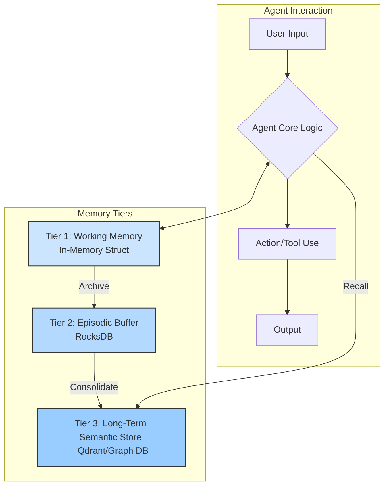
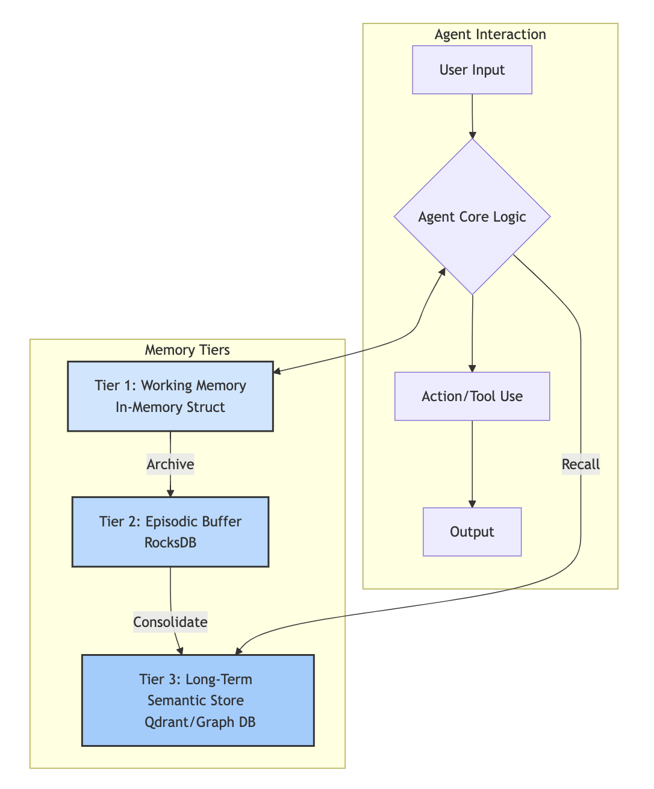

# Beyond Chat History: Building Human-Like Memory for AI Agents with `kowalski-memory`

How do you give an AI agent a memory that’s more than just a chat log? This question led to the creation of `kowalski-memory`, a Rust-based, multi-tiered memory system for agentic AI. Let’s take a journey through the philosophy, technical architecture, and the real-world challenges of building a memory system that doesn’t just store data, but learns, forgets, and grows—much like we do.

---

## Why Agentic Memory Needs to Be More Than a Database

Imagine talking to someone who forgets everything the moment you stop speaking. That’s how most AI agents operate today. They might remember the last message or two, or keep a raw log of your conversations, but they lack the ability to recall, summarize, and learn from experience. Real intelligence, whether human or artificial, is about more than just storage—it’s about the *management* of memory: what to keep, what to forget, and how to transform fleeting experience into lasting knowledge.

Inspired by cognitive science, `kowalski-memory` is built around the idea of a multi-tiered memory architecture. Each tier is designed for a specific function, echoing the layers of human memory: working memory for the present, episodic memory for recent events, and semantic memory for distilled knowledge.
- **Working Memory**: What the agent is thinking about right now  
- **Episodic Memory**: A detailed log of recent events  
- **Semantic Memory**: A structured, searchable library of distilled knowledge
---

## The Three Tiers: A Human-Inspired Design

Let’s walk through the three tiers, not as a checklist, but as a living system.

When an agent is in the middle of a conversation, it relies on its working memory. This is the scratchpad of the mind, holding the immediate context—recent messages, plans, and tool outputs. In Rust, this is as simple as a `Vec<Message>`, lightning-fast but ephemeral. When the conversation ends, this memory is flushed, making way for new experiences.

But what happens to those experiences? They don’t just vanish. Instead, they’re archived in the episodic buffer—a kind of journal that records the agent’s life in high fidelity. Here, we use an embedded key-value store like RocksDB. It’s persistent, fast, and can recall every detail of recent events. Of course, even journals must be pruned, so we use a time-to-live policy to keep things manageable.

The real magic happens in the long-term semantic store. This is the agent’s true “brain,” where knowledge is distilled and organized. Instead of storing raw conversations, we use a vector database like Qdrant to enable semantic search—so the agent can find memories by meaning, not just keywords. For relationships and structured knowledge, a graph database can be added, capturing the web of facts and entities the agent has learned.

Here’s a diagram to visualize this architecture:





---

## The Memory Management Pipeline: Weaving and Recall

Storing data is only half the battle. The real challenge is managing the flow of information between these tiers. In `kowalski-memory`, this is handled by two background processes: the Memory Weaver and the Recall Engine.

The Memory Weaver is like the subconscious mind, working quietly in the 
background. Every so often, it scans the episodic buffer for new 
experiences. For each conversation, it calls on a large language model (LLM) 
to summarize what happened and extract key facts or relationships. These 
summaries and facts are then embedded as vectors and stored in the long-term 
semantic store. If you want to see how this might look in Rust, here’s a 
simplified trait for the consolidation process:

```rust
#[async_trait::async_trait]
pub trait MemoryWeaver {
    async fn run(&mut self, delete_original: bool) -> Result<(), Box<dyn std::error::Error>>;
}
```


### The Weaving Process

The Memory Weaver (such as the `Consolidator`) is like the subconscious mind, working quietly in the background. Every so often, it scans the episodic buffer for new experiences. For each conversation, it calls on a large language model (LLM) to summarize what happened and extract key facts or relationships. These summaries and facts are then embedded as vectors and stored in the long-term semantic store.

The Recall Engine, on the other hand, is the agent’s librarian. When the agent needs to answer a question, the Recall Engine formulates a query, searches the vector database for semantically similar memories, and optionally queries the graph database for direct relationships. The results are then re-ranked—again, often with the help of an LLM—to ensure only the most relevant memories are injected back into working memory.

---

## Technical Details: Under the Hood

Everything in `kowalski-memory` is written in Rust, chosen for its speed, safety, and ability to handle concurrency with ease. RocksDB serves as the backbone for episodic memory, providing fast, embeddable storage. For semantic memory, Qdrant enables powerful vector search, letting the agent find memories by meaning. Background tasks like consolidation run asynchronously with Tokio, ensuring the agent’s main loop is never blocked.

The architecture is built for extensibility. The core interfaces are defined as Rust traits—`MemoryProvider`, `MemoryWeaver`—so you can swap out storage backends, embedding models, retrieval strategies, or even the entire consolidation process as your needs evolve. For example, you might want to use a different vector database, or plug in a domain-specific LLM for summarization. Here’s how a basic memory trait might look:

```rust
pub trait MemoryProvider {
    async fn add(&mut self, memory: MemoryUnit) -> Result<(), String>;
    async fn retrieve(&self, query: &str, retrieval_limit: usize) -> Result<Vec<MemoryUnit>, String>;
    async fn search(&self, query: MemoryQuery) -> Result<Vec<MemoryUnit>, String>;
}
```

---

## Extension Points and Real-World Considerations

One of the joys—and challenges—of building a system like this is the sheer number of ways you can extend it. Maybe you want to use a cloud-native database instead of RocksDB, or experiment with different embedding models. Perhaps your application needs a richer graph schema to capture complex relationships, or you want to add user feedback to improve retrieval. The architecture is designed to make these changes as painless as possible.

But with great power comes great responsibility. There are important considerations to keep in mind. Large language models have a limited context window, so you can’t just dump all of memory into working memory—you need to select and inject only the most relevant pieces. As your agent’s experience grows, efficient indexing and retrieval become critical. Latency matters, too: background tasks must never block the main agent loop. And don’t forget about privacy—sometimes, sensitive data needs to be purged or anonymized, especially in long-term storage.

Deciding what to keep, what to summarize, and what to forget is a subtle art. It’s not just a technical problem, but a philosophical one. The cost of running LLMs for summarization and re-ranking can add up, so you may need to batch requests, cache results, or use smaller models for some tasks. Ultimately, the goal is to create an agent that doesn’t just talk, but remembers, learns, and grows.

---

## The Payoff: Smarter, More Human Agents

With `kowalski-memory`, agents can recall what happened last week, not just the last message. They can learn and generalize from experience, forget what’s no longer useful, and answer questions with context and depth. This is a step toward truly intelligent, continuously learning AI—one that feels less like a chatbot, and more like a thoughtful collaborator.

If you’re curious to dive deeper, check out the [memory architecture documentation](memory_architecture.md) or explore the code on GitHub. The journey to human-like memory in AI is just beginning, and there’s plenty of room for you to make your mark.

---

*If you found this interesting, follow for more deep dives into the architecture of next-generation AI agents!* 