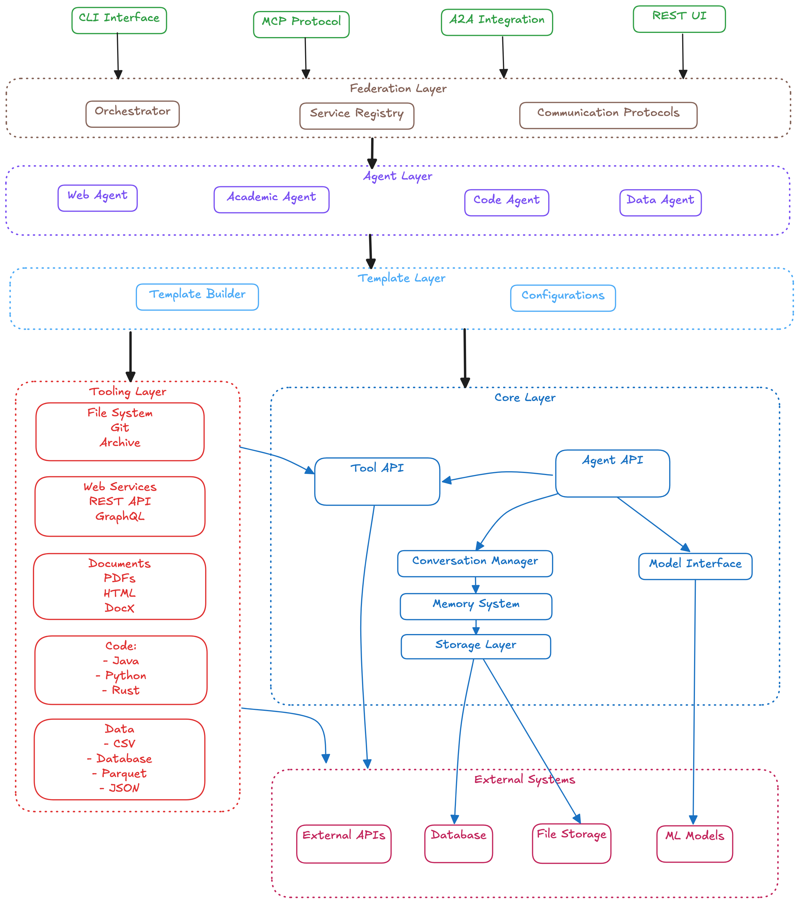
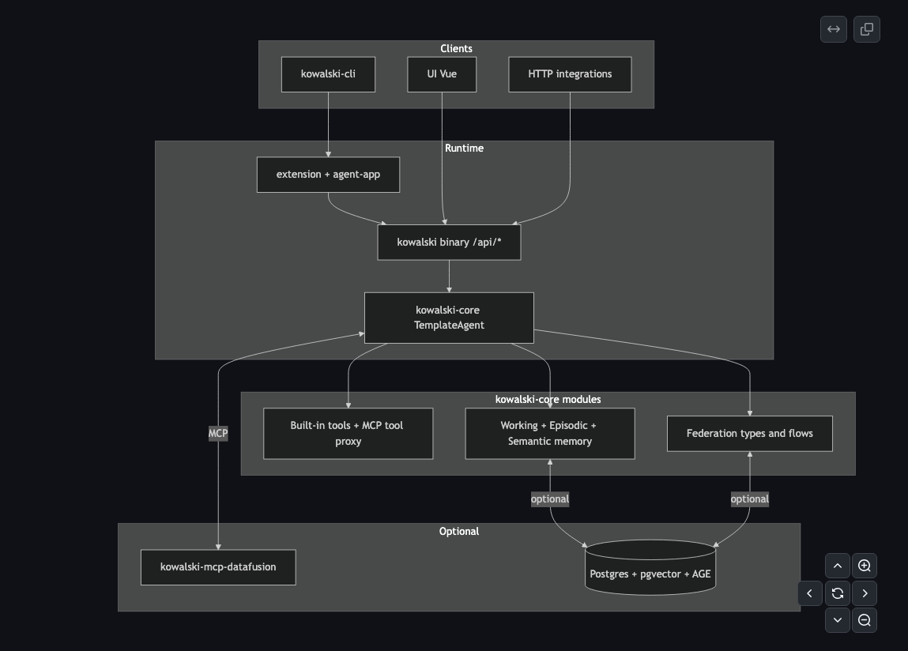

<!-- post: date=2026-09-26; summary=From a weekend Ollama wrapper to one binary that answers questions about your spreadsheets: eighteen months of diagrams, and why almost every good change removed something. -->
# Eighteen months of Kowalski: an architecture that kept getting smaller

*September 2026*

Kowalski started on 4 March 2025 as a weekend experiment: a Rust program that could talk to a
local Ollama model. Eighteen months, 721 commits and a dozen releases later, it is a single binary
that small-business owners can download, point at their spreadsheets, and get a report workbook
back from.

Looking back at the diagrams we drew along the way, one pattern stands out. Almost every good
change *removed* something: a crate, a dependency, a process, a layer, and finally the model's
authority over numbers. This is the story of those removals.

---

## March 2025 — "Hello, Ollama" (0.1 to 0.3)

The first three releases arrived in six days. 0.1.0 was, in the changelog's own words, "proof that
we could make it work, and a lot of hopes and dreams": a CLI, one Ollama connection, streaming
replies. 0.2 added conversations, roles, and PDF and text input; 0.3 a proper command line with
`kowalski chat`, `kowalski academic` and model management.

There was no architecture yet, and that was fine. The useful thing we learned was what an "agent"
had to be in this codebase: a model, a conversation, a role (a system prompt) and some way to pull
documents in.

## June–July 2025 — The Great Restructurization (0.5)

Then we drew the architecture we thought we needed.

Five layers: a Federation layer (orchestrator, service registry, communication protocols) on top
of an Agent layer (web, academic, code and data agents), a Template layer, a Tooling layer that
promised file systems, Git, REST, GraphQL, PDFs, DOCX, Java, Python, Rust, CSV, Parquet and more,
and a Core layer with its own memory system and storage layer. Four front doors: CLI, MCP, A2A and
a REST UI.

0.5.0 made it real as a workspace of many crates: `kowalski-core`, `kowalski-agent-template`,
`kowalski-tools`, `kowalski-federation`, and one crate per agent. Memory got the full treatment:
Qdrant for vectors in a proof of concept, RocksDB for the episodic log, `petgraph` for relations.
June and July 2025 were the busiest months the project has had: 226 commits.

It was a good exercise and a bad product. Each agent crate was a slightly different copy of the
same idea (a model with a different system prompt and a different tool list). Each dependency was
a daemon to run or a native library to build. The federation layer described a distributed system
nobody was running. And nothing in it could be handed to someone who does not write Rust.

## February–April 2026 — Consolidation (1.0)

After a quiet autumn, 1.0 undid most of 0.5, deliberately.

- **The agent crates collapsed into one `TemplateAgent`.** A persona is configuration plus a
  prompt plus a tool list, not a crate.
- **The memory stack went dependency-light.** RocksDB became a SQLite file through `sqlx`.
  `petgraph` became a `HashMap` of edges ("one fewer dependency; same behaviour for the current
  query pattern"). Qdrant stayed a proof of concept; semantic memory defaults to in-process
  vectors, with Postgres and pgvector as an opt-in feature.
- **An HTTP server and a Vue UI** appeared, so the thing could be used without a terminal.
- **MCP became the way to reach tools**, with the first data server: DataFusion over CSV and
  Parquet, which would later become tableski.

April 2026 alone had 171 commits, most of them deleting or moving code. The guiding sentence,
written into the design notes then and still true: prefer simple, robust defaults with minimal
moving parts.

## April–June 2026 — Hordes (1.1 to 1.4)

The 1.2 picture is already recognisable: clients on top, one `kowalski` binary serving `/api/*`,
`kowalski-core` with tools, memory and federation types, and optional pieces at the bottom. What it
does not show is the idea that arrived in 1.1 and gave the project its shape: **the horde.**

A horde is a folder. `horde.md` names a pipeline; each file in `agents/` is one step (we call them
penguins); prompts are Markdown. The first one, the Knowledge Compiler, ran ingest → compile → ask
→ lint and wrote Markdown artifacts you could read. No database schema, no UI-only format: a
horde can be diffed, copied and reviewed like any other file.

1.3 added the **Rookery**, a builder that writes horde folders from a conversation, and made it
an MCP server of its own. 1.4 turned pipelines into graphs with fork, join and loop-back edges.
In this era, steps still ran as separate worker processes that registered with the server over
a federation protocol, the last living piece of the 0.5 federation layer.

## August 2026 — Autonomy and Ecosystem (1.7, 1.8)

1.7 removed the workers. Every standard step kind now runs **inside the server** through a step
handler registry, with process isolation as an opt-in for code you do not trust. In exchange, runs
became **durable**: every transition is written to SQLite before it takes effect, and a restart
resumes where it stopped. Hordes gained **triggers** (cron, file watch, webhook), so they could
work without anyone clicking, and **portable bundles**, so they could move between machines.

1.8 removed things from the repository itself. The MCP server framework became
[emperor-mcp](https://github.com/yarenty/emperor-mcp) and the DataFusion server became
[tableski](https://github.com/yarenty/tableski), both standalone projects. The workspace shrank to
four crates, with a policy to keep it that way: new servers get their own repositories.

## September 2026 — The product (2.0, 2.1)

The latest picture has one black frame: one process, started by one command, holding the UI, the
API, the horde runner and the agent core. Everything outside it is chosen by the user: a model, a
data tool, the web.

2.0 made that frame literal. The UI and the built-in hordes are compiled into the binary; a Setup
screen writes the config (three questions: model, files folder, tableski sign-in). 2.1 added
standing orders (a Morning Brief on a schedule, a Folder Watcher on an inbox), download-and-run
binaries, and defaults that ask before a step runs a command.

The most important change of the whole eighteen months is small and easy to miss in the diagram.
In the Spreadsheet Analyst, four of six steps use **no model at all**: one profiles the tables
through tableski, one runs the SQL, one builds the workbook. The model writes the queries and
explains results it is handed. It never produces a number.

We got there by watching a 7B local model fail. Asked to profile tables with tools, it printed the
tool call as text instead of making it. Asked to write SQL without an exact schema, it queried a
table that does not exist. Every such failure point became a plain, deterministic step, and the
model was left with the one job it does well. A wrong query now fails loudly in the engine,
instead of quietly in a report.

---

## What eighteen months taught us

- **Delete layers you are not running.** The 0.5 federation layer described a system we did not
  have. Its last trace, worker processes, went in 1.7, and nothing got worse.
- **Dependencies are daemons someone has to keep alive.** Qdrant, RocksDB and `petgraph` each
  made sense alone. Together they made kowalski hard to install. SQLite and a `HashMap` covered
  the real use.
- **Make the unit of work a file.** Hordes as folders made everything else easy: review, version
  control, a builder that writes them, bundles that move them.
- **Give the model less to do.** The more a step matters to correctness, the less of it should
  depend on sampling. Engines compute; models write.
- **Ship the frame, not the parts.** Nobody wants four crates. People want one thing that opens in
  a browser and answers a question about their spreadsheet.

The full current architecture, with diagrams of one run and of the run lifecycle, is in
[`docs/architecture.html`](../architecture.html). Kowalski is open source at
[github.com/yarenty/kowalski](https://github.com/yarenty/kowalski).
