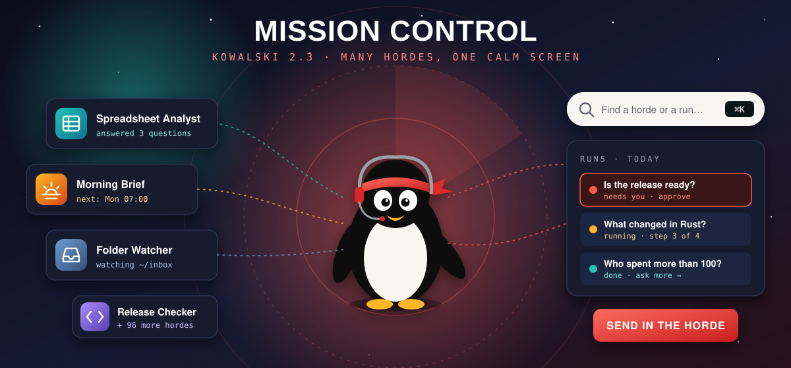
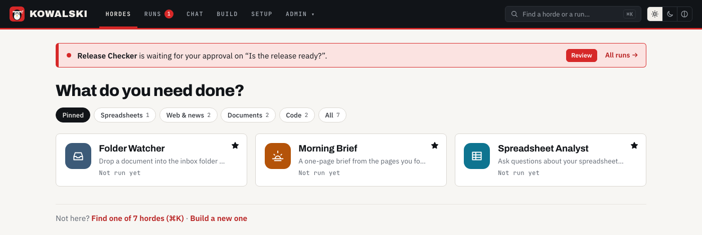
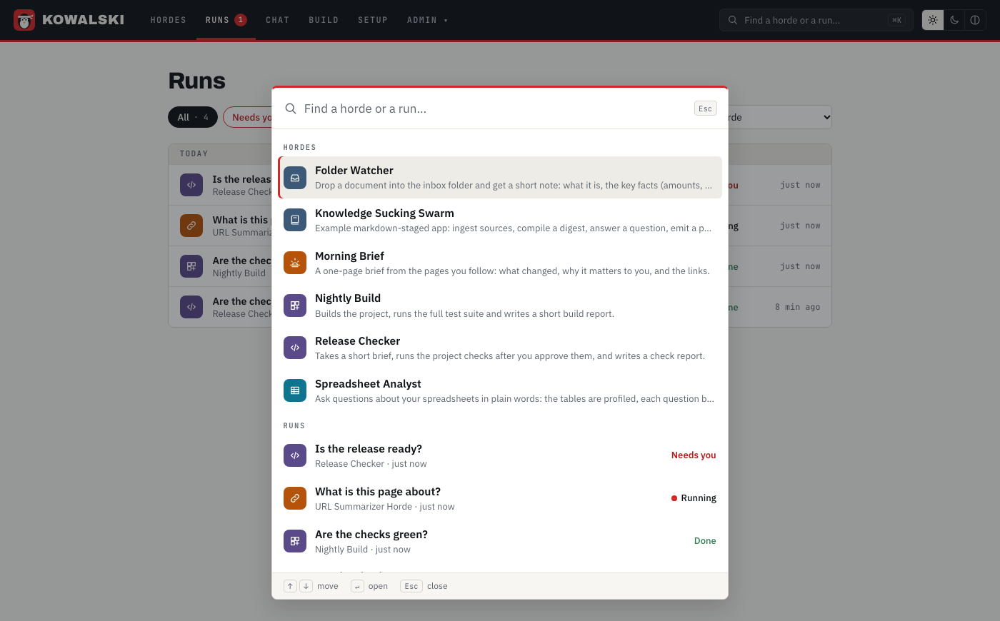

<!-- post: date=2026-09-27; slug=kowalski-2-3; summary=Kowalski 2.3 Mission Control: a calm home with icon tiles, every run in one list named by what you asked, ⌘K to find anything, workbooks uploaded from kowalski, and follow-up questions on the same data. -->
# Kowalski 2.3: Mission Control

*September 2026*



2.2 made kowalski readable. Then we used it every day, and three things got in the way. Every
click on Hordes showed every horde. The list down the side took half the screen. And every run in
the history had the same name, so "yesterday's question about the budget" meant opening each one
until you found it.

2.3 is the fix. We called it **Mission Control**: a hundred hordes installed and still one calm
screen.

## A home that asks one question

The Hordes screen now opens on **"What do you need done?"** and a few large tiles: the hordes you
pinned (or, until you pin some, the three we ship as featured). Each tile has a coloured icon for
its kind of work (teal for spreadsheets, amber for web and news, steel for documents, violet for
code) and one line of status: when it runs next, which folder it watches, or how its last run
went.



Chips filter by kind, and **All** stays quiet with a hundred hordes installed: smaller tiles, twelve
at a time. The red strip at the top shows up only when a run needs you, for example a step waiting
for your approval before it runs a command.

## Every run, named by what you asked

Runs have titles now, taken from what you asked: *"Who spent more than 100?"*, the name of the file
the Folder watcher picked up, or *"Scheduled run"* for the 7:00 brief. The new **Runs** page lists
them across all hordes, grouped by day, with filters for *Needs you* and *Failed*, and a link for
every run so you can send it to someone.

## ⌘K for everything

Press **⌘K** (or Ctrl+K) anywhere and type. The picker finds hordes by name or description, and
recent runs by their titles. Enter opens the one you picked. With a hundred hordes it's the fastest
way in, and with five it still saves you a click.



## Spreadsheets without leaving kowalski

The Spreadsheet analyst used to need a second browser tab to upload a workbook to
[tableski](https://tableski.io). Now the horde page has a **Workbooks** card: drop a file on it and
it is uploaded to your tableski account, ready for the next question.

When an answer arrives, **Ask more about this data** starts a follow-up. It's a new run with its own
title, it works on the same tables, and it knows what was already asked. *"Which people spent
more than 100 in total?"* then *"How old is the top spender?"* works the way you'd expect.

Real workbooks are messy, so the analyst doesn't give up on them anymore. A sheet without a
header row (a form, a budget template, a report) is read as labelled rows instead of a table, the
answers still come back, and a short tip at the end says how to lay the file out for better
results. It's advice, not a requirement.

## Smaller things that add up

- A horde's form no longer empties itself while you type, and hordes with their own form show
  only that form.
- The Morning brief's pages live in one place, its form, so the scheduled run and a run you start
  by hand read the same links.
- Setup shows the new settings right after its restart, key fields have a show/hide button, and
  Save only lights up when something changed.
- Chat with tools no longer mistakes a code block in an answer for a broken tool call, and a tool
  loop never ends in an empty reply.

## Get it

```bash
curl -fsSL https://raw.githubusercontent.com/yarenty/kowalski/main/install.sh | bash
kowalski
```

Pre-built for macOS and Linux, Intel or ARM. The crates are on
[crates.io](https://crates.io/crates/kowalski) too. Everything is open source under MIT at
[github.com/yarenty/kowalski](https://github.com/yarenty/kowalski); the full list of changes is in
the [changelog](https://github.com/yarenty/kowalski/blob/main/CHANGELOG.md). New here? Start with
[what 2.2 brought](release-2-2.md), or with how the analyst keeps the numbers honest in
[Ask your spreadsheets](ask-your-spreadsheets.md).
