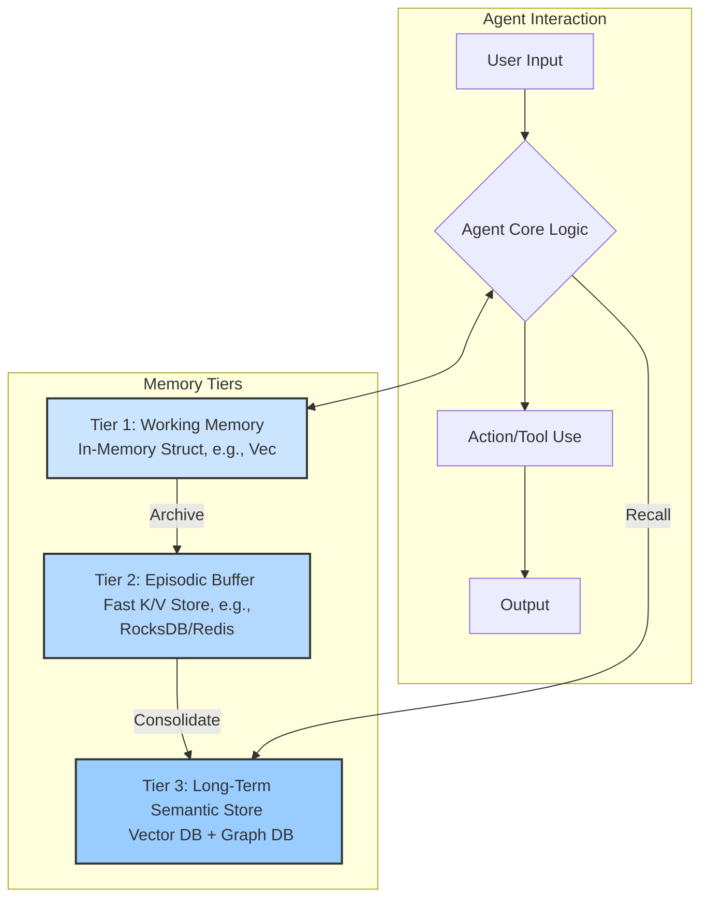

# A Multi-Tiered Architecture for Agentic Memory

**A Design for Short-Term Recall, Long-Term Knowledge, and Autonomous Consolidation**

---

## 1. High-Level Philosophy: Mimicking Human Memory

A successful agentic memory system should not be a single, monolithic database. It should be a dynamic, multi-tiered system inspired by the functional layers of human memory:

*   **Working Memory (Short-Term):** What the agent is thinking about *right now*. It's fast, volatile, and has a limited capacity. It holds the immediate context of the current task or conversation.

*   **Episodic Memory (Medium-Term):** The memory of recent events or conversations. It's a high-fidelity log of what happened, stored in chronological order. It answers the question, "What did we talk about an hour ago?"

*   **Semantic Memory (Long-Term):** The vast library of distilled facts, concepts, and summarized experiences. This memory is not a raw log; it's a structured, searchable knowledge base. It answers the question, "What are the key facts I know about Project X?"

The core challenge is not just storing data, but intelligently **managing the flow of information** between these tiers—deciding what to forget, what to keep, and what to transform from raw experience into lasting knowledge.

---

## 2. Detailed Architectural Solution: The Three Tiers

Here is a concrete architecture for implementing this three-tiered system within a framework like Kowalski.

### Tier 1: Working Memory (The Scratchpad)
*   **Purpose:** To hold the immediate context for the current, active task. This includes the last N messages in a conversation, the plan the agent is currently executing, and data from recent tool calls.
*   **Storage Technology:** A simple in-memory data structure within the agent's process. In Rust, this would be a `Vec<Message>` or a similar struct.
*   **Characteristics:** Extremely fast access, small capacity, volatile (lost when the agent process restarts or the conversation ends).
*   **Management:** A simple sliding window or a fixed-size buffer. Once the conversation is over, its entire contents are flushed to Tier 2 for archival.

### Tier 2: Episodic Buffer (The Journal)
*   **Purpose:** To store the full, high-fidelity history of recent conversations and tasks. This allows the agent to recall entire past interactions perfectly.
*   **Storage Technology:** A high-performance, embedded key-value store. **RocksDB** is a perfect choice for a Rust-based project like Kowalski, as it's embeddable, extremely fast, and requires no separate server.
*   **Characteristics:** Fast reads/writes, much larger capacity than working memory, persistent. Data is stored chronologically, indexed by a conversation ID or timestamp.
*   **Management:** Data is written here after a task is completed. It should have a Time-to-Live (TTL) policy (e.g., automatically purge records older than 7-30 days) to keep the store from growing indefinitely. Its primary role is to be the source for the long-term memory consolidation process.

### Tier 3: Long-Term Semantic Store (The Library)
*   **Purpose:** To store distilled, permanent knowledge. This is the agent's true "brain." It doesn't store conversations verbatim; it stores the *meaning* extracted from them.
*   **Storage Technology:** A dual-component system:
    1.  **Vector Database (e.g., Qdrant, Weaviate, Pinecone):** This is the core of semantic retrieval. Every piece of knowledge is converted into a vector embedding. This allows the agent to find relevant memories based on conceptual similarity, not just keywords.
    2.  **(Optional but powerful) Graph Database (e.g., Neo4j, or a Rust-native graph DB):** For storing structured relationships between entities (e.g., "User A *works on* Project X," "Project X *uses* Rust"). This allows for complex, relational queries that vector search alone cannot handle.
*   **Characteristics:** Slower than other tiers, but offers powerful query capabilities. Designed for permanent storage.
*   **Management:** Data is added to this tier exclusively through the **Memory Consolidation Process**.

---

## 3. The Memory Management Pipeline

This is the set of background processes that manage the memory flow. Think of it as the agent's autonomous subconscious.

### Process 1: The Memory Weaver (Consolidation)
This is the most critical process. It runs periodically (e.g., every few hours) as a background task.

1.  **Scan Tier 2:** It scans the Episodic Buffer for recent conversations that haven't been consolidated yet.
2.  **Summarize & Extract:** For each conversation, it uses an LLM (a powerful one like GPT-4 or a local fine-tuned model) with a specific prompt to perform two tasks:
    *   **Summarization:** Create a concise summary of the conversation.
    *   **Fact Extraction:** Identify and extract key entities, facts, and relationships, structuring them as triplets (e.g., `(subject, predicate, object)` -> `('Kowalski', 'is_built_on', 'Rust')`).
3.  **Embed & Store:**
    *   The summary and each extracted fact are converted into vector embeddings.
    *   These embeddings, along with the original text, are stored in the **Vector Database (Tier 3)**.
    *   The structured triplets are stored in the **Graph Database (Tier 3)**.
4.  **Mark as Processed:** The conversation in Tier 2 is marked as "consolidated" so it isn't processed again.

### Process 2: The Recall Engine (Retrieval)
When the agent needs to access its long-term memory to inform a response, it uses a hybrid retrieval strategy:

1.  **Query Formulation:** The agent's core logic formulates a query based on the current conversation (e.g., "User is asking about deploying Kowalski on AWS").
2.  **Hybrid Search:** The Recall Engine performs a parallel search:
    *   **Semantic Search:** It converts the query into an embedding and searches the Vector DB for the top-K most similar memories.
    *   **Graph Search:** It extracts key entities from the query ("Kowalski", "AWS") and queries the Graph DB for direct relationships.
3.  **Relevance Ranking (Re-ranking):** The raw results from both searches are fed into an LLM with a prompt like: `"Given the current query '...', which of the following retrieved memories are most relevant?"` This crucial step filters out noise and provides the agent with a small, highly-relevant set of memories.
4.  **Context Injection:** These top, re-ranked memories are injected into the agent's Working Memory (Tier 1) to provide the necessary context for generating its final response.

---

## 4. Implementation in Kowalski

`kowalski-memory` crate.

*   define `Memory` and `Recall` traits.
*   use Rust `rocksdb` for the embedded Tier 2 store.
*   use `qdrant-client` for interacting with the Vector DB.
*   The Memory Weaver - an asynchronous `tokio` background task, ensuring it doesn't block the main agent loop.

By designing memory as a multi-tiered, actively managed system, we move beyond simple chat history and create the foundation for a truly intelligent and continuously learning AI agent.