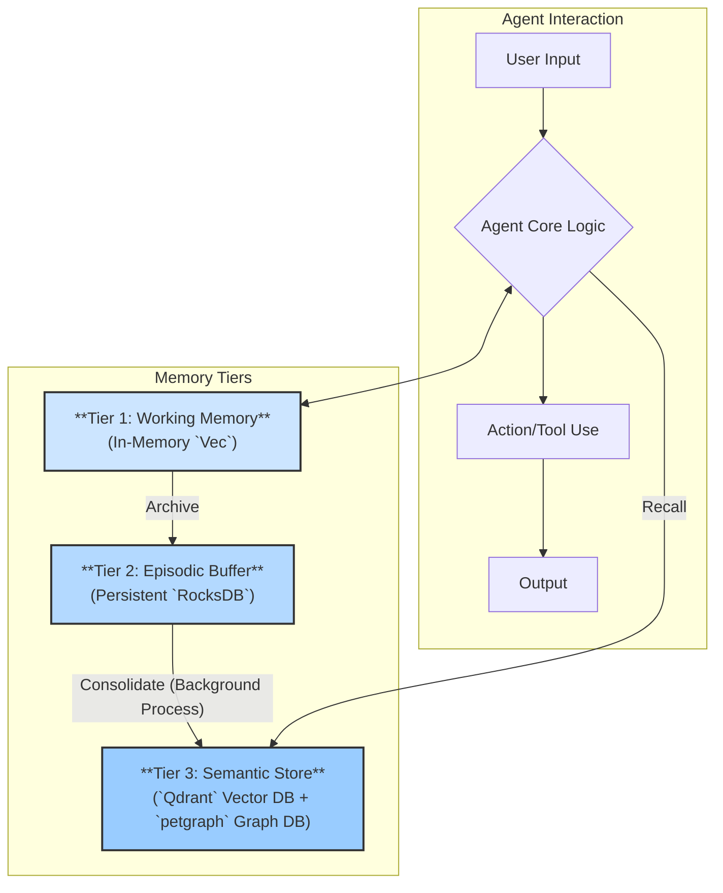

# Kowalski Memory Module

This crate provides a sophisticated, multi-tiered memory system for the Kowalski Agent Framework. It is designed to give agents a robust and scalable memory, moving beyond simple conversation history to enable true learning, context retention, and knowledge consolidation.

---

## 1. Core Architecture: A Multi-Tiered Approach

The memory system is inspired by the functional layers of human memory, separating concerns into three distinct tiers. This architecture ensures that the agent has fast access to immediate context while also being able to build and query a vast, long-term knowledge base.



*   **Tier 1: Working Memory (`working.rs`):** A simple, volatile, in-memory vector that holds the immediate context for the agent's current task. It's fast, limited in size, and is cleared after each task.

*   **Tier 2: Episodic Buffer (`episodic.rs`):** A persistent, chronological log of all interactions, stored in an embedded **RocksDB** database. This acts as the agent's high-fidelity journal of past events.

*   **Tier 3: Semantic Store (`semantic.rs`):** The agent's permanent, long-term memory. It combines two powerful technologies:
    *   **Qdrant (Vector Database):** For storing and retrieving memories based on their conceptual meaning (semantic search).
    *   **petgraph (In-Memory Graph):** For storing and querying structured relationships between entities (e.g., "Kowalski -> is_written_in -> Rust").

## 2. Code Structure

The crate is organized around the three tiers and a central `lib.rs` that defines the core abstractions.

*   `src/lib.rs`: Defines the `MemoryProvider` trait, which is the core interface for all memory stores. It also defines the `MemoryUnit` and `MemoryQuery` structs.
*   `src/working.rs`: Implementation of the Tier 1 working memory.
*   `src/episodic.rs`: Implementation of the Tier 2 episodic buffer.
*   `src/semantic.rs`: Implementation of the Tier 3 semantic store.

## 3. Setup and Initialization (Step-by-Step)

To use the full capabilities of this memory module, especially the Tier 3 Semantic Store, you need to set up a Qdrant vector database instance.

### Step 1: Run Qdrant using Docker

This is the easiest way to get a Qdrant instance running locally.

```bash
# Pull the latest Qdrant image
docker pull qdrant/qdrant

# Run the Qdrant container
docker run -p 6333:6333 -p 6334:6334 \
    -v $(pwd)/qdrant_storage:/qdrant/storage \
    qdrant/qdrant
```

This command starts Qdrant and maps its gRPC port (`6334`) and HTTP REST API port (`6333`) to your local machine. The `qdrant_storage` volume ensures your data is persisted across container restarts.

### Step 2: Create the Qdrant Collection

Before the `SemanticStore` can be used, you must create a "collection" in Qdrant to hold the memory vectors. You can do this with a simple `curl` command. The vector size must match the size produced by your embedding model (e.g., many models use a size of `4096`, but we use `4` in our tests for simplicity).

```bash
# For a vector size of 4 (used in tests)
curl -X PUT http://localhost:6333/collections/kowalski_memory \
    -H 'Content-Type: application/json' \
    --data-raw '{
        "vectors": {
            "size": 4,
            "distance": "Cosine"
        }
    }'

# For real
 curl -X PUT "http://localhost:6333/collections/kowalski_memory"  \ 
         -H "Content-Type: application/json" \
         -d '{
       "vectors": {
         "size": 3072,
         "distance": "Cosine"
       }
     }'
{"result":true,"status":"ok","time":0.053068822}⏎    
```

**To check if it worked:** You should see `{"result":true,"status":"ok"}`. You can also visit the Qdrant Web UI in your browser at `http://localhost:6333/dashboard` to see the new collection.

### Specifics for `petgraph` (The In-Memory Graph)

Unlike Qdrant, `petgraph` is a pure Rust library and requires no external setup.

*   **Role:** It stores explicit relationships between entities, like `(Kowalski) -[is_written_in]-> (Rust)`.
*   **Initialization:** The graph is created empty every time the `SemanticStore` is initialized.
*   **Data Format:** To add a relationship to the graph, you must add a `MemoryUnit` whose `content` is a JSON string with three specific keys:
    ```json
    {"subject": "Kowalski", "predicate": "has_module", "object": "kowalski-memory"}
    ```
*   **Persistence:** **Crucially, the graph is currently NOT persistent.** It exists only in memory and will be wiped clean when the agent restarts. For true long-term relational memory, a future implementation would need to serialize this graph to a file (e.g., using `serde` and `bincode`) or replace `petgraph` with a persistent graph database like Neo4j.
*   **How to Check it's Working:**
    1.  **Logs:** Look for `debug` level logs like `"Adding new node 'Kowalski' to graph"` and `info` level logs like `"Added relationship to graph: Kowalski -[has_module]-> kowalski-memory"`.
    2.  **Tests:** The `test_add_and_query_graph` function in `semantic.rs` is a self-contained unit test that validates the graph functionality without any external dependencies.

### Step 3: Initialize in Kowalski


The `BaseAgent` in `kowalski-core` is already set up to initialize all three tiers. As long as your Qdrant container is running, the agent will connect to it on startup.

## 4. Testing the Memory System

The crate includes a full suite of unit and integration tests.

### Running the Tests

To run all tests (including the ignored integration tests), you need a running Qdrant instance (as set up above). Then, run the following command:

```bash
# The --features flag enables test-only dependencies like `uuid`
# The -- --ignored flag includes tests marked with #[ignore]
# The --test-threads=1 is crucial to prevent tests from interfering with each other's DB access
cargo test -p kowalski-memory --features kowalski-memory/testing -- --ignored --test-threads=1
```

### How to Check if it's Working During Usage

1.  **Check the Logs:** The module is instrumented with `log`. Run the agent with a high log level (`RUST_LOG=debug`) to see detailed information about memory operations.
    *   Look for logs like `"Adding memory unit to episodic buffer..."`
    *   Look for logs like `"Added relationship to graph..."`
    *   Look for logs from the `qdrant-client` showing successful connections and point insertions.

2.  **Inspect the Filesystem:**
    *   After running the agent, you should see a directory named `db/episodic_buffer` created in your project root. This is the RocksDB database for Tier 2.

3.  **Query the Qdrant Dashboard:**
    *   After adding memories with embeddings, go to the Qdrant dashboard at `http://localhost:6333/dashboard`.
    *   Select the `kowalski_memory` collection. You should see the point count increase, and you can even inspect the stored points.

By following these steps, you can set up, use, and verify the functionality of the entire multi-tiered memory system.