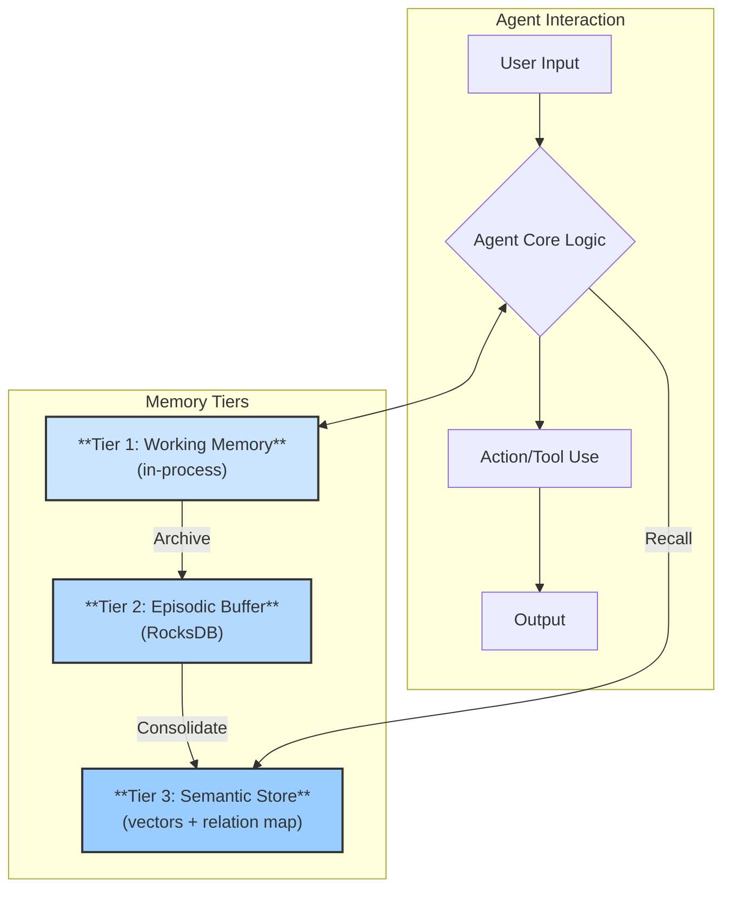

# Kowalski memory module

Multi-tiered memory for agents: working (scratchpad), episodic (journal), and semantic (distilled knowledge + relationships).

> **Design context:** Early delivery used **Qdrant** as a **proof of concept** for vector-backed semantic memory. The **ongoing goal** is a **simple, robust, dependency-light** stack with **few moving parts**—see [`docs/DESIGN_MEMORY_AND_DEPENDENCIES.md`](../docs/DESIGN_MEMORY_AND_DEPENDENCIES.md).

---

## 1. Three tiers


```mermaid
graph TD
    subgraph Agent Interaction
        A[User Input] --> B{Agent Core Logic};
        B --> C[Action/Tool Use];
        C --> D[Output];
    end

    subgraph Memory Tiers
        T1["**Tier 1: Working Memory**<br>(in-process)"]
        T2["**Tier 2: Episodic Buffer**<br>(RocksDB)"]
        T3["**Tier 3: Semantic Store**<br>(vectors + relation map)"]
    end

    B <--> T1;
    T1 -- Archive --> T2;
    T2 -- Consolidate --> T3;
    B -- Recall --> T3;

    style T1 fill:#cce5ff,stroke:#333,stroke-width:2px
    style T2 fill:#b3d9ff,stroke:#333,stroke-width:2px
    style T3 fill:#99ccff,stroke:#333,stroke-width:2px
```

| Tier | Role | Implementation (current) |
|------|------|----------------------------|
| **1 – Working** | Immediate context for the active task | In-process structures; limited size, volatile |
| **2 – Episodic** | Chronological, high-fidelity log of recent interactions | **RocksDB** (embedded, no separate server) |
| **3 – Semantic** | Distilled knowledge: similarity search + optional relational edges | **In-process** embedding index (cosine similarity) + **`HashMap` relation edges** (no extra graph crate) |

---

## 2. Code layout

| Path | Purpose |
|------|---------|
| `memory/mod.rs` | `MemoryProvider`, `MemoryUnit`, `MemoryQuery` |
| `memory/working.rs` | Tier 1 |
| `memory/episodic.rs` | Tier 2 |
| `memory/semantic.rs` | Tier 3 (vectors + graph) |
| `memory/consolidation.rs` | Consolidation (“Memory Weaver”) into semantic tier |
| `memory/helpers.rs` | Helpers to construct default provider set from config |

---

## 3. Setup (current)

- **No Qdrant** (or other vector service) is required for the default build.
- **Ollama** (or your configured LLM provider) is still needed for chat/embeddings when those features are used.
- **RocksDB** creates its database under the configured episodic path (e.g. `memory.episodic_path`).
- Optional **SQL** migrations run when `memory.database_url` is set (e.g. `sqlite:…`); see [`src/db/mod.rs`](./src/db/mod.rs) and the repo `migrations/` folder.

### Graph relationships (in-memory map)

Outgoing edges are stored as **subject → [(predicate, object), …]** in a `HashMap` (no separate graph library). To record a triple, add a `MemoryUnit` whose `content` is JSON:

```json
{"subject": "Kowalski", "predicate": "has_module", "object": "kowalski-core"}
```

Relations are **not persisted** across process restarts unless you add serialization or an external store (future work).

---

## 4. Testing

```bash
cargo test -p kowalski-core
```

Memory tests do **not** require an external vector database.

---

## 5. Optional future backends

Deployments that need **scale-out** or **shared** vector search may add **Postgres + pgvector**, **sqlite-vec**, or a **managed vector service**—as **optional** integrations, aligned with [`docs/DESIGN_MEMORY_AND_DEPENDENCIES.md`](../docs/DESIGN_MEMORY_AND_DEPENDENCIES.md).
